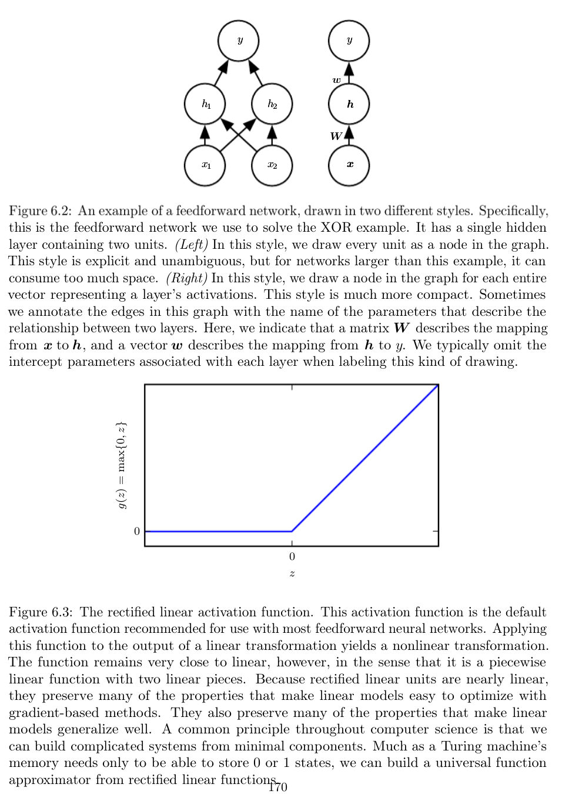

# Deep feedforward networks

Deep feedforward networks or multilayer perceptron approximate some function $f^*$ for e.g., a classifier $y =f^*(x)$ maps an input $x$ to a category $y$. A feedforward network defines a mapping of $y = f(x; \theta)$ and learns the values of the parameters $\theta$ that result in the best function approximation. Models are called feedforward because of the directional flow of information (no feedback connections). Models that include feedback connections are called _Recurrent neural networks_.

Feedforward models are called networks as they are composed of different functions. The model is associated with a directed acyclic graph of functions, e.g., $f^{(1)}, f^{(2)}, f^{(3)}$ connected in chain to form $f^{(3)}(f^{(2)}(f^{(1)}(x)))$. In this case, $f^{(1)}$ is the first layer, $f^{(2)}$ the second layer, and so on. The overall length of the chain is called the _depth_ of the network. The final layer is the output layer.

The training examples specify what the output layers must do at each point $x$; it must produce a value that is close to $y$. The training data do not directly specify the behavior of other layers. The learning algorithm must decide how to use those layers to produce the desired output, but the training data does not say what each layer should do. Because the training data does not show the desired output for each of these layers, they are called _hidden layers_.

Each hidden layer is vector-valued. The dimension of the hidden layer determines the _width_ of the model. Each layer consists of many units that work in parallel, each representing a vector to a scalar function.

Consider a linear model; they are limited by their capacity to model only linear functions, so they cannot understand the interactions between any two input variables. To extend the linear models to represent non-linear functions of $x$, we apply the linear model to a transformed input $\phi(x)$ rather than $x$ itself. Where $\phi(x)$ is a non-linear transformation. We can also use the kernel trick to achieve this effect. We can think of $\phi$ as providing a set of features describing $x$ or a new representation of $x$. 

How to choose $\phi$:
- select a generic $\phi$, but hard to generalize as they do not encode enough prior information to solve the problem.
- manually engineer $\phi$ for the specific task. 
- Strategy of DL is to learn $\phi$. We have a model $y = f(x; \theta, w) = \phi(x;\theta)^Tw$. The parameter $\theta$ to learn $\phi$ from a broad class of functions. Parameter $w$ maps $\phi(x)$ to the desired output. This is an example of feedforward network with $\phi$ defining a hidden layer. $\phi(x; \theta)$ can use either generic broad set of functions or human-tuned case-specific set of functions. 

## Learning XOR

XOR (Exclusive OR) operation on two binary values $x_1$ and $x_2$ when exactly one of the binary value is equal to one, XOR returns one and zero otherwise. XOR target function $y = f^*(x)$ that we want to learn. Our model $y = f(x; \theta)$ model which learns the parameter $\theta$ to make a similar function as $f^*$ as possible. The model is set-up as a regression problem and we use a MSE loss function. However, in practice, MSE is not an appropriate cost function for binary data. MSE on the whole training set of all four points $X = \{[0,0]^T, [0, 1]^T, [1, 0]^T, [1,1]^T\}$:

$$J(\theta) = \frac{1}{4}\sum_{x\in X} (f^*(x) - f(x; \theta))^2$$

Suppose we choose a linear model for $f(x;\theta)$ with $\theta$ consisting of $w$ and $b$:

$$f(x; w, b) = x^T w + b$$

Minimizing $J(\theta)$ with respect to $w$ and $b$ we obtain $w=0$ and $b=0.5$. The linear model will output 0.5 everywhere. When $x_1 = 0$, the model output should increase as $x_2$ increases. The model output must decrease when $x_1 = 1$ and $x_2$ increases. Since the linear model must apply a fixed coefficient $w_2$ to $x_2$, the  linear model cannot use the value of $x_1$ to change the coefficient of $x_2$ and cannot solve the problem.

In neural network, a linear model outputs 1 for both $x= [0, 1] \&  [1,0]$ by mapping both points to a single point in feature space $h=[1,0]$. The linear model can thus define the function as increasing in $h_1$ and decreasing in $h_2$ and cannot solve the problem. We need to make the model capacity greater to fit the training set.

The feedforward network has a vector of hidden units $h$, that are computed by $f^1(x; W, c)$. The values of the hidden layer are used as an input to the subsequent layer. Output is still a linear regression but applied to $h$ rather than $x$. The network has two functions: $h = f^1(x; W, c)$ and $y = f^2(h; w, b)$. The complete model is written as:

$$f(x; W, c, w, b) = f^2(f^1(x))$$

If we made $f^(1)$ linear $W^Tx$ the whole function would be linear: $f^2(x) = h^Tw \rightarrow f(x) = w^T W^T x$. Hence, we must use a non-linear function. Neural networks use an affine transformation controlled by learned parameters followed by a fixed non-linear function called an _activation function_: $h = g(W^Tx + c)$, where $W$ is the weight of linear transformation and $b$ the biases. Defining an affine transformation from a vector $x$ to a vector $h$, so an entire vector of bias parameters are needed. Activation function is chosen to be a function that is applied element-wise with $h_i = g(x^T W_{:,i} + c_i)$. In modern neural network the default recommendation is to use **Rectified Linear Unit (ReLU)** defined as $g(z) = \max \{0, z\}$. Apply the ReLU activation to an output of a linear transformation yields a non-linear transform. Our complete network now looks like:

$$f(x; W, c, w, b) = w \max \{0, W^Tx + c\} + b$$

To solve XOR, we have the following matrices:

$$W = \begin{bmatrix}
1 & 1 \\
1 & 1 \\
\end{bmatrix}, 
\quad
c =  \begin{bmatrix}
0 \\
-1 \\
\end{bmatrix},
\quad
w =  \begin{bmatrix}
1 \\
-2 \\
\end{bmatrix},
\quad 
b = 0
$$

If we have $X$ as:
 $$X = \begin{bmatrix}
0 & 0 \\
0 & 1 \\
1 & 0 \\
1 & 1 \\
\end{bmatrix}$$

 $$XW = \begin{bmatrix}
0 & 0 \\
1 & 1 \\
1 & 1 \\
2 & 2 \\
\end{bmatrix}, 
\quad
XW + c = \begin{bmatrix}
0 & -1 \\
1 & 0 \\
1 & 0 \\
2 & 1 \\
\end{bmatrix}$$

In this space, all examples lie along a line of slope 1. As we move along this line the output need to begin from 0, raise to 1 and drop back to 0.  A linear model cannot implement such a function. To finish computing $h$ we apply the ReLU transformation:

 $$\begin{bmatrix}
0 & 0 \\
1 & 0 \\
1 & 0 \\
2 & 1 \\
\end{bmatrix}$$

Now we apply the weight vector $w = \begin{bmatrix} 1 \\ -2 \\ \end{bmatrix}$ to the output of ReLU:

 $$\begin{bmatrix}
0 \\
1 \\
1 \\
0 \\
\end{bmatrix}$$

The neural network has obtained the correct answer for every example in the batch.

