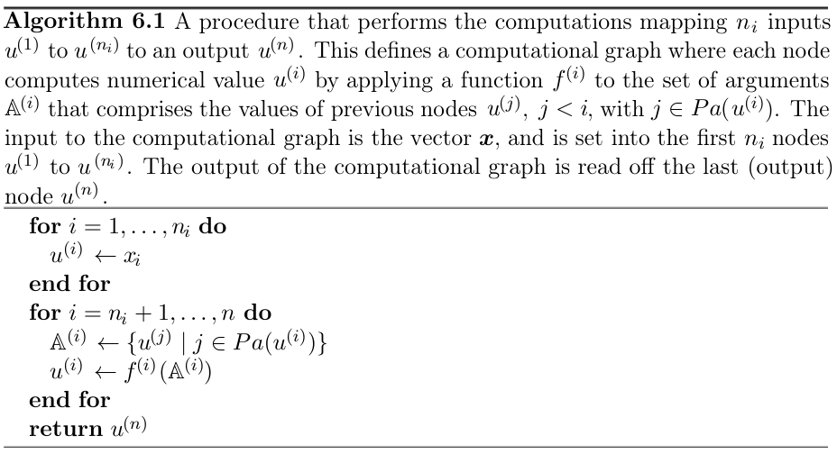
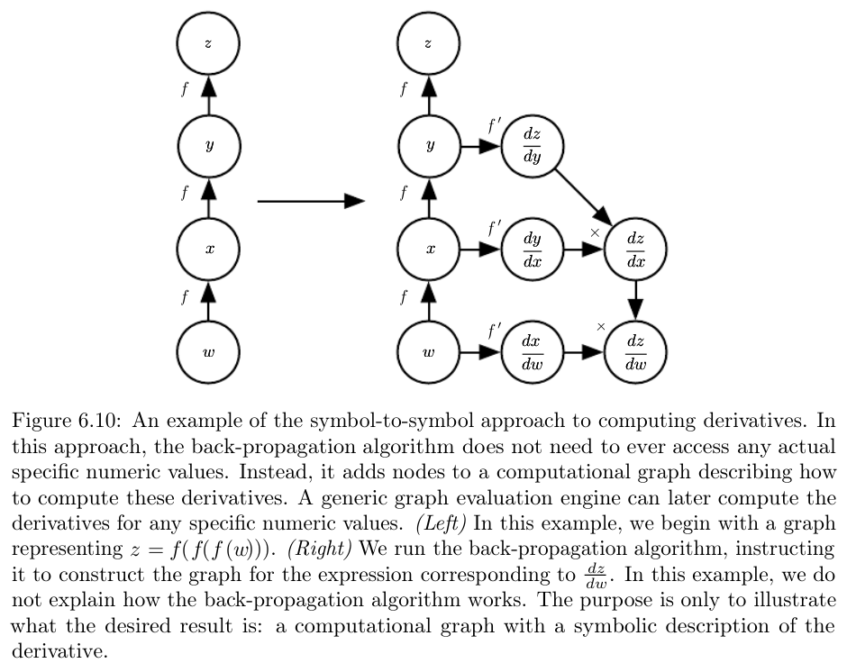

## Backpropagation

When we use a feedforward network to accept an input $x$ and produce an output $\hat{y}$ information flows forward through the network. Input $x$ provides the initial information that then propagates up through the hidden units at each layer and finally produces $\hat{y}$. This is called __forward propagation__. During training, forward propagation continues until it produces a scalar cost $J(\theta)$. The __back propagation__ allows the information from the cost to then flow backward through the network in order to compute the gradient. Backpropagation only refers to the method of computing the gradient, and a method like stochastic gradient descent is used to perform the actual learning. 

### Computational graphs

Each node in a graph indicates a variable (scalar, vector, matrix, tensor, or another variable). An operation is a simple function of one or more variables that returns only a single output variable. Functions may be composed of many operations tied together. If a variable $y$ is computed by applying an operation to a variable $x$, we draw a directed edge from $x$ to $y$. We sometimes annotate the output node with the name of the operation applied. 

### Chain rule of calculus

Suppose $y = g(x)$ and $z = f(g(x)) = f(y)$. The chain rule states that:

$$\frac{dz}{dx} = \frac{dz}{dy}\frac{dy}{dx}$$

In a more general form:

$$\frac{\partial z}{\partial x_i} = \sum_j  \frac{\partial z}{\partial y_j}\frac{\partial y_j}{\partial x_i}$$

For Tensors $\mathbf{Y} = g(\mathbf{X})$ and $z = f(\mathbf{Y})$, then

$$\nabla_\mathbf{X} z = \sum_j (\nabla_{\mathbf{X}}Y_j) \frac{\partial z}{\partial Y_j}$$

Naively applying chain rule is infeasible as it results in computing the same sub-expressions exponentially many times, which is wasteful. Consider the following: $x = f(w)$, $y = f(x)$, $z = f(y)$. 

$$\frac{\partial z}{\partial w} = f^\prime(y)f^\prime(x)f^\prime(w) = f^\prime(f(f(w)))f^\prime(f(w))f^\prime(w)$$

Consider a computational graph describing how to compute a single scalar $u^{(n)}$. We want to obtain the gradient of this quantity $y$, with respect to the $n_i$ input nodes $u^{(1)}$ to $u^{(n_i)}$. We wish to compute $\frac{\partial u^{(n)}}{\partial u^{(i)}} \quad i \in \{1, 2, \dots n_i\}$. Each node $u^{(i)}$ is associated with an operation $f^{(i)}$ with $\mathbb{A}^{(i)}$ is set of all nodes that are parents of $u^{(i)} = f(\mathbb{A}^{(i)})$.

Nodes of the graph have been ordered in a way to compute one output after other. Starting at $u^{(n_i + 1)}$ to $u^{(n)}$. This is forward propagation computation, which we put in graph $\mathcal{G}$. To perform backward propagation, we can construct a computational graph that depends on $\mathcal{G}$ and add to it an extra set of nodes. These form a subgraph $\mathcal{B}$ with one node per node of $\mathcal{G}$. Computation in $\mathcal{B}$ proceeds in exactly the reverse order of computation in $\mathcal{G}$ and each node of $\mathcal{B}$ computes the derivative $\frac{\partial u^{(n)}}{\partial u^{(i)}}$ associated with the forward graph node $u^{(i)}$:

$$\frac{\partial u^{(n)}}{\partial u^{(j)}} = \sum_{i, j \in Pa(u^{(i)})} \frac{\partial u^{(n)}}{\partial u^{(i)}}\frac{\partial u^{(i)}}{\partial u^{(j)}}$$

The subgraph $\mathcal{B}$ contains exactly one edge for each edge from node $u^{(j)}$ to node $u^{(i)}$ of $\mathcal{G}$. The edge from $u^{(j)}$ to $u^{(i)}$ is associated with the computation of $\partial u^{(i)}/\partial u^{(j)}$. Backpropagation is designed to reduce the number of operations without regard to memory and avoid exponential explosion in repeated sub-expressions.

Backpropagation is very simple. To compute the gradient of a scalar $z$ with respect to one of its ancestors $x$ in a graph, we obtain by observing that the gradient with respect to $z$ is given by $\frac{dz}{dz} = 1$. We can then compute the gradient with respect to each parent of $z$ in the graph by multiplying the current gradient by the Jacobian of the operation that produced $z$. We continue multiplying by Jacobians, traveling backward through the graph until we reach $x$. For any node that may be reached by going backward from $z$ through two or more paths, we simply sum the gradients arriving from different paths at that node. 

The backpropagation method should always pretend that all its inputs are distinct from each other, even if they are not. For e.g., if the $mul$ operator is passed two copies of $x$ to compute $x^2$, the $op.bprop$ method should still return $x$ as the derivative with respect to both the inputs. The backpropagation algorithm will later add both of these arguments together to obtain $2x$, which is the correct total derivative of $x$. 

Computing a gradient in a graph with $n$ nodes will never execute more than $O(n^2)$ operations or store the output of more than $O(n^2)$ operations. An operation is defined as the fundamental unit of our computational graph, which may consists of several arithmetic operations. The backpropagation algorithm adds on Jacobian-Vector product, which is expressed with $O(n)$ nodes per edge in original graph. Because the computation graph is a directed acyclic graph it has at most $O(n^2)$ edges. In practice, backpropagation has at $O(n)$ cost, better than the naive approach which has an exponential cost. Backpropagation is a table filling algorithm that stores the immediate results of $\frac{\partial u^{(i)}}{\partial u^{(j)}}$. Each node in the graph has a corresponding slot in a table to store the gradient for that node. By filling these table entries in order, backpropagation avoids repeating many common subexpressions, this approach is called dynamic programming. The memory cost is $O(m n_h)$, where $m$ is the number of examples in minibatch and $n_h$ is the number of hidden units. 

Backpropagation is one approach of automatic differentiation and a special case of a broad class of techniques called as the reverse mode accumulation. When the forward graph $\mathcal{G}$ has a single output node and each partial derivative  $\frac{\partial u^{(i)}}{\partial u^{(j)}}$ can be computed with a constant amount of computation, backpropagation gurantees that the number of computations for the gradient is the same order as the number of computation for the forward computation $O(#edges)$.

When the number of outputs of the graph is larger than the number of inputs, it is sometimes preferable to use another form of automatic differentiation called **forward mode accumulation**, which avoids the need to store the values and gradients of the whole graph trading computer efficiency for memory. The relationship between the forward mode and reverse mode is analogous to the relation between left-multiplying and right-multiplying a sequence of matrices (think of Jacobians):

$$\mathbf{A}\mathbf{B}\mathbf{C}\mathbf{D}$$

If $\mathbf{D}$ is a column matrix and $\mathbf{A}$ is a row matrix, it is cheaper to compute the multiplications left to right.

### Krylov methods

Krylov methods are a set of iterative techniques performing various operations, such as approximately inverting a matrix or finding approximations to its eigen vectors and eigen values without using any operations other than matrix-vector products.

### Summary of feedforward networks

Feedfoward networks can be seen as efficient nonlinear function approximators based on using gradient descent to minimize the error in a function approximation. Larger datasets have reduced the degree to which statistical generalization is a challenge for neural networks and neural networks have become much larger thanks to powerful computers and software. 