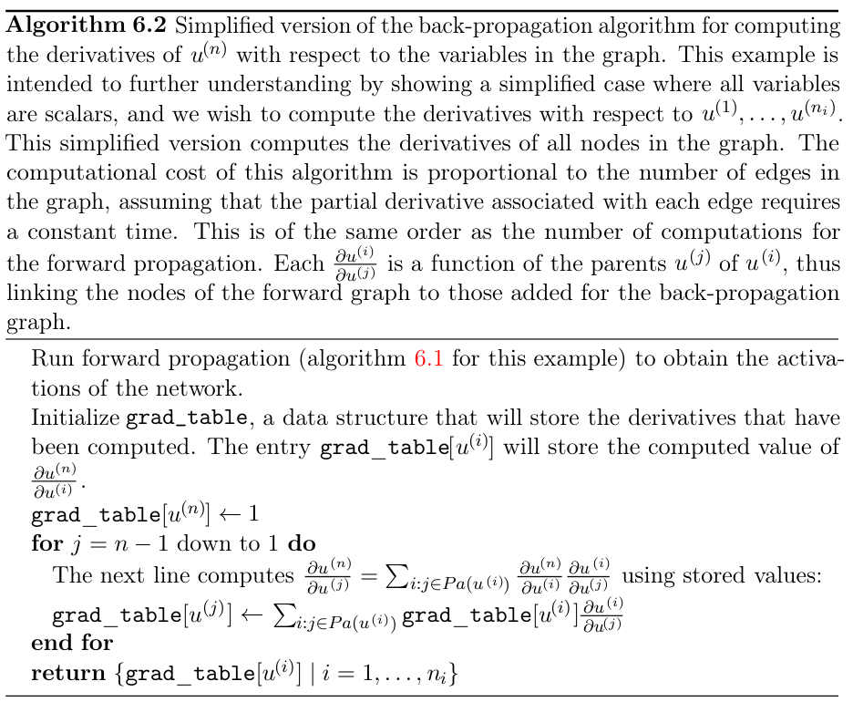
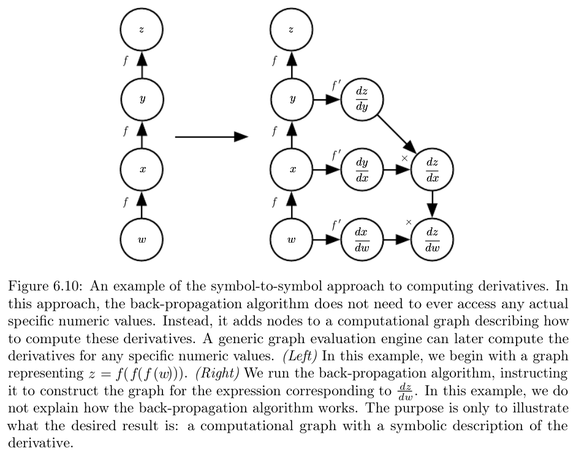

## Backpropagation

When we use a feedforward network to accept an input $x$ and produce an output $\hat{y}$ information flows forward through the network. Input $x$ provides the initial information that then propagates up through the hidden units at each layer and finally produces $\hat{y}$. This is called __forward propagation__. During training, forward propagation continues until it produces a scalar cost $J(\theta)$. The __back propagation__ allows the information from the cost to then flow backward through the network in order to compute the gradient. Backpropagation only refers to the method of computing the gradient, and a method like stochastic gradient descent is used to perform the actual learning. 

### Computational graphs

Each node in a graph indicates a variable (scalar, vector, matrix, tensor, or another variable). An operation is a simple function of one or more variables that returns only a single output variable. Functions may be composed of many operations tied together. If a variable $y$ is computed by applying an operation to a variable $x$, we draw a directed edge from $x$ to $y$. We sometimes annotate the output node with the name of the operation applied. 

### Chain rule of calculus

Suppose $y = g(x)$ and $z = f(g(x)) = f(y)$. The chain rule states that:

$$\frac{dz}{dx} = \frac{dz}{dy}\frac{dy}{dx}$$

In a more general form:

$$\frac{\partial z}{\partial x_i} = \sum_j  \frac{\partial z}{\partial y_j}\frac{\partial y_j}{\partial x_i}$$

For Tensors $\mathbf{Y} = g(\mathbf{X})$ and $z = f(\mathbf{Y})$, then

$$\nabla_\mathbf{X} z = \sum_j (\nabla_{\mathbf{X}}Y_j) \frac{\partial z}{\partial Y_j}$$

Naively applying chain rule is infeasible as it results in computing the same sub-expressions exponentially many times, which is wasteful. Consider the following: $x = f(w)$, $y = f(x)$, $z = f(y)$. 

$$\frac{\partial z}{\partial w} = f^\prime(y)f^\prime(x)f^\prime(w) = f^\prime(f(f(w)))f^\prime(f(w))f^\prime(w)$$

Consider a computational graph describing how to compute a single scalar $u^{(n)}$. We want to obtain the gradient of this quantity $y$, with respect to the $n_i$ input nodes $u^{(1)}$ to $u^{(n_i)}$. We wish to compute $\frac{\partial u^{(n)}}{\partial u^{(i)}} \quad i \in \{1, 2, \dots n_i\}$. Each node $u^{(i)}$ is associated with an operation $f^{(i)}$ with $\mathbb{A}^{(i)}$ is set of all nodes that are parents of $u^{(i)} = f(\mathbb{A}^{(i)})$.

Nodes of the graph have been ordered in a way to compute one output after other. Starting at $u^{(n_i + 1)}$ to $u^{(n)}$. This is forward propagation computation, which we put in graph $\mathcal{G}$. To perform backward propagation, we can construct a computational graph that depends on $\mathcal{G}$ and add to it an extra set of nodes. These form a subgraph $\mathcal{B}$ with one node per node of $\mathcal{G}$. Computation in $\mathcal{B}$ proceeds in exactly the reverse order of computation in $\mathcal{G}$ and each node of $\mathcal{B}$ computes the derivative $\frac{\partial u^{(n)}}{\partial u^{(i)}}$ associated with the forward graph node $u^{(i)}$:

$$\frac{\partial u^{(n)}}{\partial u^{(j)}} = \sum_{i, j \in Pa(u^{(i)})} \frac{\partial u^{(n)}}{\partial u^{(i)}}\frac{\partial u^{(i)}}{\partial u^{(j)}}$$

The subgraph $\mathcal{B}$ contains exactly one edge for each edge from node $u^{(j)}$ to node $u^{(i)}$ of $\mathcal{G}$. The edge from $u^{(j)}$ to $u^{(i)}$ is associated with the computation of $\partial u^{(i)}/\partial u^{(j)}$. Backpropagation is designed to reduce the number of operations without regard to memory and avoid exponential explosion in repeated sub-expressions.

