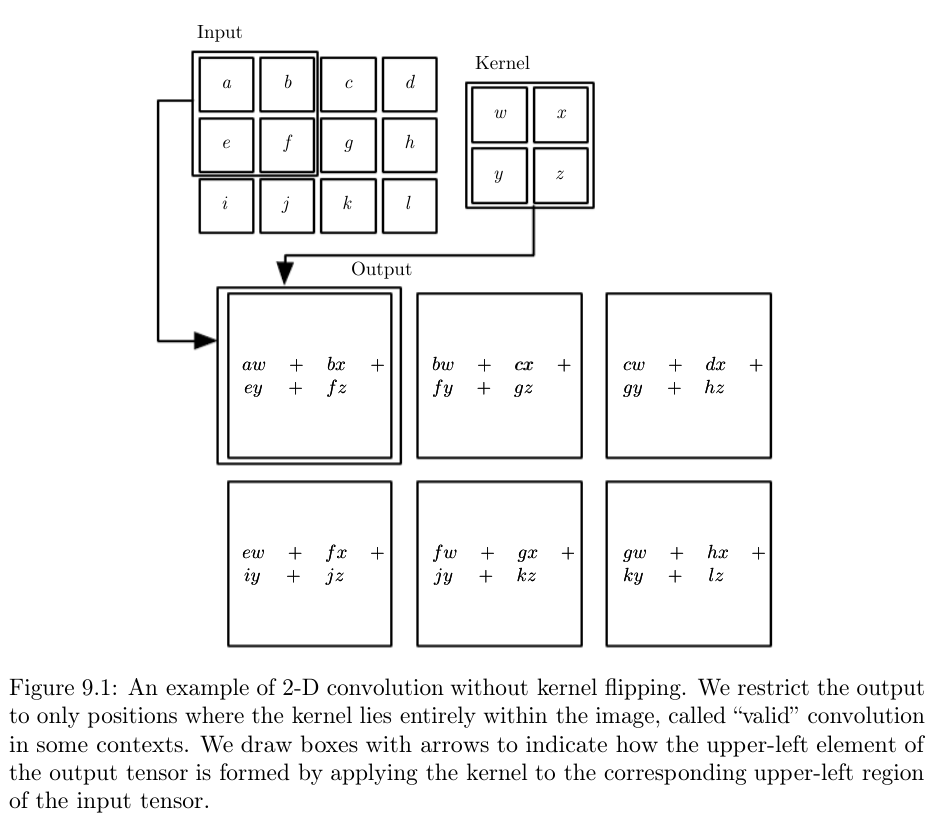

# Convolution Neural Networks (CNNs)
CNNs are a specialized neural network for processing data on a grid-like topology. Convolution is a special kind of linear operation. CNNs use convolution in place of general matrix multiplication in at least one of the layers. 

Consider a spaceship for which we measure the location $x(t)$. However, the measurement is noisy. To correct for this noise, we use a weighting function $w(a)$, where $a$ is the age of measurement and $w$ gives more weights to recent measurements. The smoothed distance is $s(t) = \int x(t) w(t - a) da$. This operation is called **convolution** and is denoted by an asterisk $s(t) = (x * w)(t)$. In convolution, the function $x$ is the input and $w$ is the kernel. The output is referred to as a **feature map**. For discrete measurements, $s(t) = (x * w)(t) = \sum_{a = -\infty}^{\infty} x(a) w(t - a)$.

In ML, the input is a multidimensional array, and the kernel is a multidimensional array of parameters that are adopted by the learning algorithm. The weight matrix is sparse, with values only for a finite number of elements. 

CNNs have sparse interactions by making the kernel smaller than the input, which reduces the burden on the number of parameters to store. If there are $m$ inputs and $n$ outputs, the algorithm used has a computational cost of $O(m\times n)$. However, CNNs only require $k \times n$ parameters, so operates on $O(k \times n)$, with $k$ several orders of magnitude smaller than $m$. 

__Parameter sharing__ refers to using the same parameters for more than one function in a model. Parameter sharing in CNN means rather than learning a separate set of parameters for every location; we learn only one set. 

__Equivariance__ to translation means that if the input changes, the output changes the same way. A function $f(x)$ is equivariant to function $g$, if $f(g(x)) = g(f(x))$. Convolution creates a 2D map of where certain features appear in the input. If we move the object in the input, its representation in the output moves by the same amount. 

## Pooling

CNN has three stages: The first stage, the layer performs several convolutions in parallel to produce a set of linear activations. In the second stage, each linear activation is run through a non-linear activation such as a ReLU. The third stage is the *detector stage*, where we use a pooling function to modify the output of the layer further. 

A pooling function replaces the output of the net at a certain location with summary statistics of the nearby outputs. For e.g., max-pooling operation reports the maximum output with a rectangular neighborhood. Other pooling functions include the average, $L^2$ norm, and weighted average. Pooling can be thought of as identifying the approximate invariant of a transformation to a small set of inputs. Invariant to a local transformation is useful to find a presence of a certain feature, rather than its precise location. Pooling can be viewed as adding infinitely strong priors that the layer must be invariants to small transformation. CNNs can be thought of as a fully connected network, but with an infinitely strong prior over its weights. 

Convolution and pooling underfit the data. If a task relies on preserving precise position information, __then using pooling on all features can increase the training error__. Some neural networks are designed to use pooling on some channels but not on others to get both highly invariant features and features that will not underfit.

If we want to sample only every $s$ pixels in each direction in the output, then we downsample the convolution function, and $s$ is the stride of this downsampled convolution. 

CNNs implicitly zero-pad their inputs, without which the representation shrinks by the kernel width minus a single pixel at each layer.  If the input image has width $m$ and the kernel has width $k$, without padding, the output shrinks by $m-k+1$. Since the shrinkage is a non-zero positive value, it limits the number of possible layers in the network. Zero paddings allow control of both the kernel width and size of the output independently. Zero padding results mean input pixels near the border influence fewer output pixels, hence somewhat underrepresented in the model than the input pixels near the center. 

The locally connected layer has no parameter sharing; each edge has its own parameters. In contrast, CNNs have shared parameters with the same weights across the entire input. Locally connected layers are useful when we know that each feature should be a function of a small part of space, but there is no reason to think that the same feature should occur across all of space. E.g., the mouth only occurs at the bottom of the face. 

Reducing the number of interactions between channels allow the network to have a fewer parameter, reducing memory consumption, increasing statistical efficiency and reducing the amount of computation needed to perform forward and back-propagation. Reducing interactions between channels accomplishes this goal without reducing the number of hidden units. 

Tiled convolution is a compromise between a convolution layer and a locally connected layer. Rather than learning a separate set of weights at every spatial location, we learn a set of kernels that we rotate as we move through space. 

Generally, we do not use only a linear operation to transform from the inputs to the outputs in a convolution layer. In CNNs, it is typical to have one bias per channel of the output and share it across all locations. 

Convolution does not make sense if the input has variable size because it can optionally include different kinds of observations. For e.g., if we are processing college applications with both grades and standardized tests, but not every applicant has a standardized test, it does not make sense to convolve the same weights over features corresponding to the grades as well as features corresponding to test scores. Convolution can be done on variable size inputs as long as the __ contains a varying amount of observations of the same kind of thing__ (e.g., different sized images).
