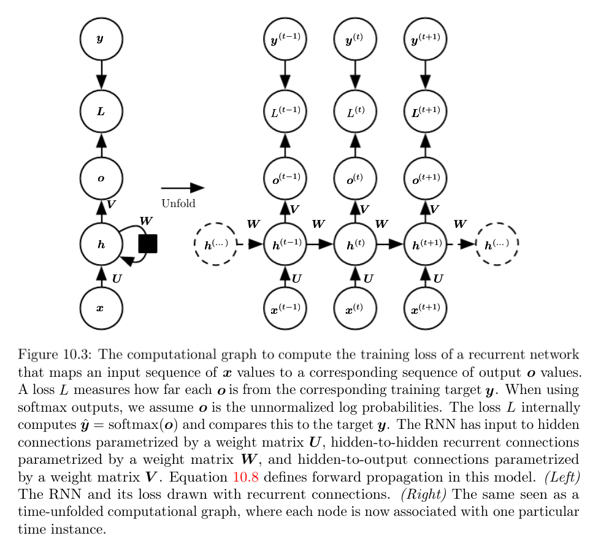

# Sequence modeling: Recurrent and recursive net

Recurrent Neural Networks or (RNNs) are a family of neural networks for processing sequential data. Much of the CNN is specialized in processing a grid of values $X$ (e.g., an image), a recurrent network is a neural network specialized for processing a sequence of values $x^{(1)}, \dots x^{(r)}$. Consider the example sentence "I went to India in 2019" and "In 2019, I went to India". A traditional fully connected feedforward neural network would have separate parameters for each input feature, so it would need to learn all the rules of the language separately at each position in the sentence. By comparison, an RNN shares the same weights across several time steps (parameter sharing). In CNNs, parameter sharing is accomplished by using the same kernel function everywhere. In RNN, each member of the output is a function of the previous members of the output. Each member of the output is produced by the same update rule applied to the previous outputs. 

The classical form of a dynamic system is written as: $s^{(t)} = f(s^{(t-1)}); \theta)$, where $s^{(t)}$ is the state of the system at time $t$. For a finite number of time steps $\tau$ each graph can be unfolded by applying the definition $\tau -1$ times. For $\tau = 3$: $s^{(3)} = f(s^{(2)}; \theta) = f(f(s^{(1)}; \theta); \theta)$. Unfolding the graph yields a non-recursive expression and can be represented as an acyclic graph. RNNs with hidden units $h$ representing the state is written as: $h^{(t)} = f(h^{(t-1)}, x^{(t)}; \theta)$. RNN is trained to perform a task that requires predicting the future from the past, the network typically learns to use $h^{(t)}$ as a kind of lossy sharing of task-relevant aspects of the past sequence of inputs up to $t$. The summary in general is lossy, since it maps an arbitrary length sequence $x^{(t)}, x^{(t-1)}, x^{(t-2)}, \dots x^{(2)}, x^{(1)}$ to a fixed length vector $h^{(t)}$. Depending on training critera this summary might selectively keep some aspects of the past sequence with more precision than other aspects. The unfolded recurrence after $t$ steps with a function $g^{(t)}$ is:

$$h^{(t)} = g^{(t)}(x^{(t)}, x^{(t-1)}, x^{(t-2)}, \dots x^{(2)}, x^{(1)}) = f(h^{(t-1)}, x^{(t)}; \theta)$$

The function $g^{(t)}$ takes the whole past sequence $x^{(t)}, x^{(t-1)}, x^{(t-2)}, \dots x^{(2)}, x^{(1)}$ as input and produces the current state, but unfolded recurrent structure allows us to factorize $g^{(t)}$ into repeated application to a function $f$. Unfolding has the following two advantages:

- Regardless of sequence length, the learned model always has the same input size, specified in terms of a transition from one state to another.
- It is possible to use the same transition function $f$ with the same parameters at every time step. 

Forward propagation begins with the specification of the initial state $h^{(0)}$. Then for each time step from $t = 1$ to $t = \tau$, we apply the following update equation:

$$a^{(t)} = b + \mathbf{W}h^{(t-1)} + \mathbf{U}x^{(t)}$$
$$h^{(t)} = \tanh (a^{(t)})$$
$$o^{(t)} = c + \mathbf{V} h(t)$$
$$\hat{y}(t) = softmax(o^{(t)})$$

$b$ is the bias vector, $c$, $\mathbf{U}$, $\mathbf{V}$, and $\mathbf{W}$ are weights. This is an example that maps an input sequence to an output sequence of the same length. Total loss is the sum of loss over all time steps. $L^{(t)}$ is negative log-likelihood $y^{(t)}$ given: $x^{(1)}, \dots x^{(t)}$: 

$$L({x^{(1)}, \dots x^{(t)}, y^{(1)}, \dots y^{(t)}}) = \sum_t = L^{(t)} = -\sum_t \log p_{model}(y^{(t)} | {x^{(1)}, \dots x^{(t)}})$$

Computation and memory cost for this RNN algorithm is $O(t)$ and cannot be parallelized. 