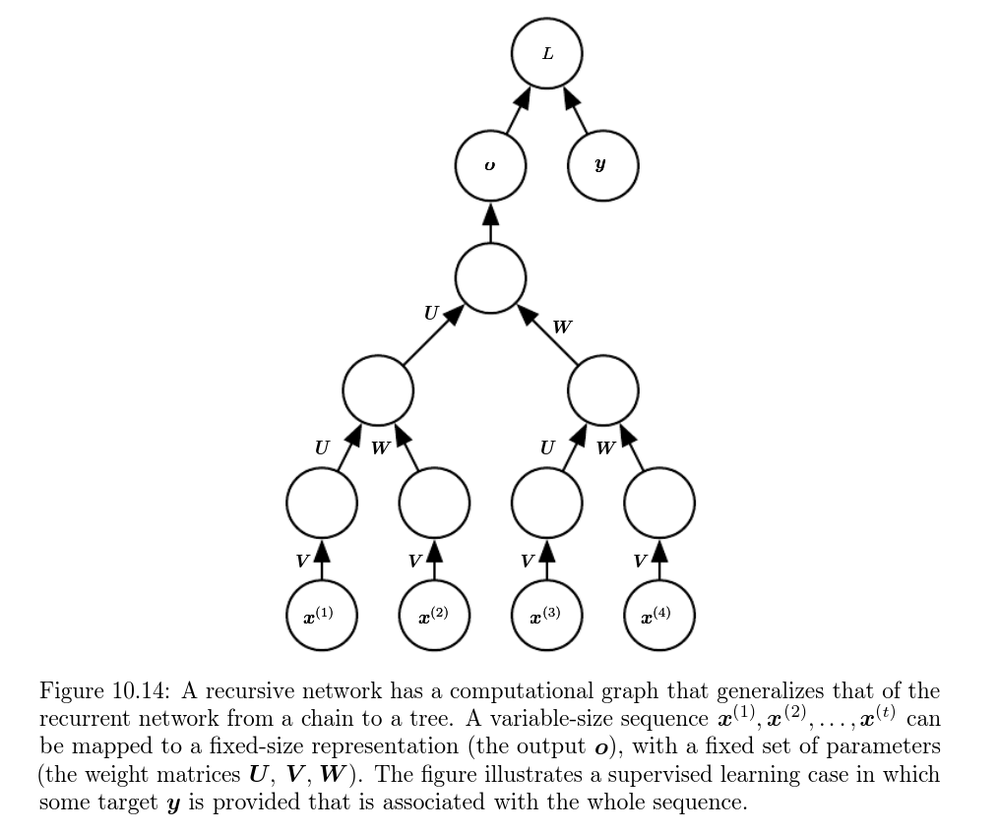
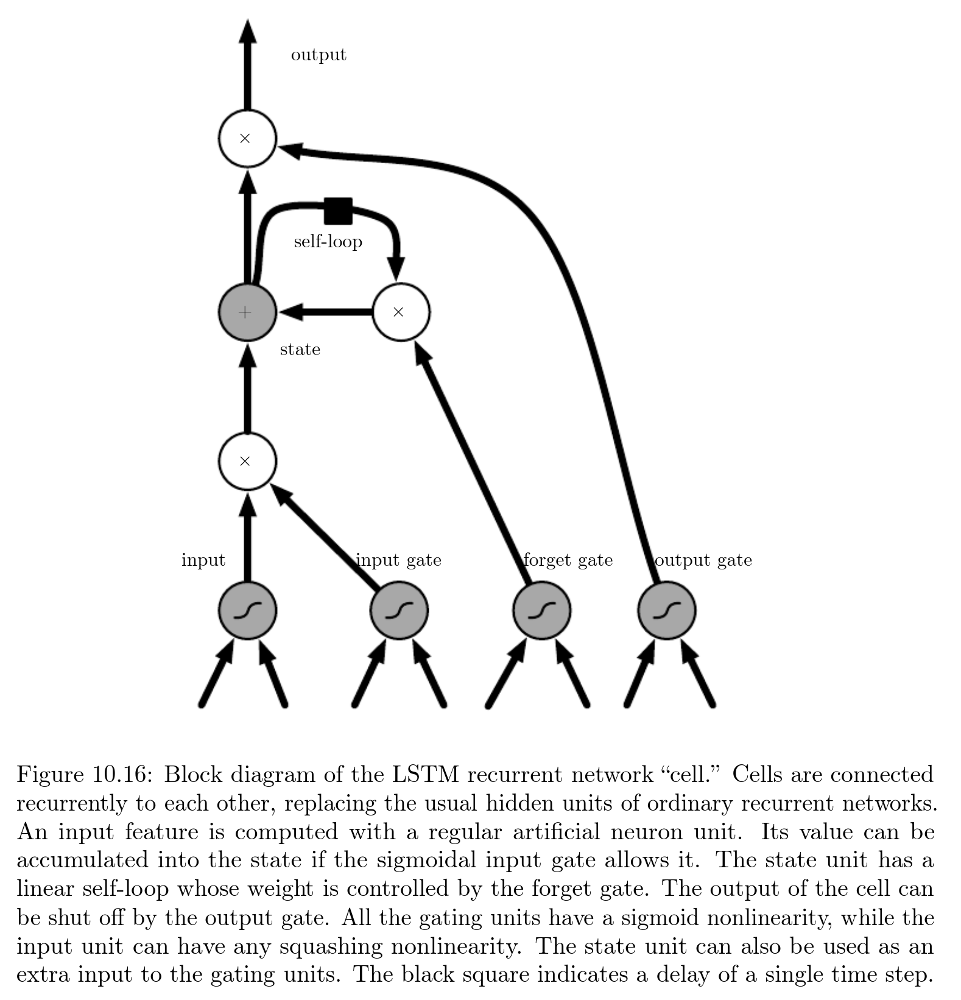

# Sequence modeling: Recurrent and recursive net

Recurrent Neural Networks or (RNNs) are a family of neural networks for processing sequential data. Much of the CNN is specialized in processing a grid of values $X$ (e.g., an image), a recurrent network is a neural network specialized for processing a sequence of values $x^{(1)}, \dots x^{(r)}$. Consider the example sentence "I went to India in 2019" and "In 2019, I went to India". A traditional fully connected feedforward neural network would have separate parameters for each input feature, so it would need to learn all the rules of the language separately at each position in the sentence. By comparison, an RNN shares the same weights across several time steps (parameter sharing). In CNNs, parameter sharing is accomplished by using the same kernel function everywhere. In RNN, each member of the output is a function of the previous members of the output. Each member of the output is produced by the same update rule applied to the previous outputs. 

The classical form of a dynamic system is written as: $s^{(t)} = f(s^{(t-1)}); \theta)$, where $s^{(t)}$ is the state of the system at time $t$. For a finite number of time steps $\tau$ each graph can be unfolded by applying the definition $\tau -1$ times. For $\tau = 3$: $s^{(3)} = f(s^{(2)}; \theta) = f(f(s^{(1)}; \theta); \theta)$. Unfolding the graph yields a non-recursive expression and can be represented as an acyclic graph. RNNs with hidden units $h$ representing the state is written as: $h^{(t)} = f(h^{(t-1)}, x^{(t)}; \theta)$. RNN is trained to perform a task that requires predicting the future from the past, the network typically learns to use $h^{(t)}$ as a kind of lossy sharing of task-relevant aspects of the past sequence of inputs up to $t$. The summary in general is lossy, since it maps an arbitrary length sequence $x^{(t)}, x^{(t-1)}, x^{(t-2)}, \dots x^{(2)}, x^{(1)}$ to a fixed length vector $h^{(t)}$. Depending on training critera this summary might selectively keep some aspects of the past sequence with more precision than other aspects. The unfolded recurrence after $t$ steps with a function $g^{(t)}$ is:

$$h^{(t)} = g^{(t)}(x^{(t)}, x^{(t-1)}, x^{(t-2)}, \dots x^{(2)}, x^{(1)}) = f(h^{(t-1)}, x^{(t)}; \theta)$$

The function $g^{(t)}$ takes the whole past sequence $x^{(t)}, x^{(t-1)}, x^{(t-2)}, \dots x^{(2)}, x^{(1)}$ as input and produces the current state, but unfolded recurrent structure allows us to factorize $g^{(t)}$ into repeated application to a function $f$. Unfolding has the following two advantages:

- Regardless of sequence length, the learned model always has the same input size, specified in terms of a transition from one state to another.
- It is possible to use the same transition function $f$ with the same parameters at every time step. 

Forward propagation begins with the specification of the initial state $h^{(0)}$. Then for each time step from $t = 1$ to $t = \tau$, we apply the following update equation:

$$a^{(t)} = b + \mathbf{W}h^{(t-1)} + \mathbf{U}x^{(t)}$$
$$h^{(t)} = \tanh (a^{(t)})$$
$$o^{(t)} = c + \mathbf{V} h(t)$$
$$\hat{y}(t) = softmax(o^{(t)})$$

$b$ is the bias vector, $c$, $\mathbf{U}$, $\mathbf{V}$, and $\mathbf{W}$ are weights. This is an example that maps an input sequence to an output sequence of the same length. Total loss is the sum of loss over all time steps. $L^{(t)}$ is negative log-likelihood $y^{(t)}$ given: $x^{(1)}, \dots x^{(t)}$: 

$$L({x^{(1)}, \dots x^{(t)}, y^{(1)}, \dots y^{(t)}}) = \sum_t = L^{(t)} = -\sum_t \log p_{model}(y^{(t)} | {x^{(1)}, \dots x^{(t)}})$$

Computation and memory cost for this RNN algorithm is $O(t)$ and cannot be parallelized. 

## RNNs as directed graphs

When we use a predictive log-likelihood training objective, we train the RNN to estimate the conditional distribution of the next sequence element $y^{(t)}$ given the past inputs. We maximize the log-likelihood: $\log P(y^{(t)} | x^{(1)}, \dots x^{(t)})$. If the model includes connections from the output at one time step to the next time step: $\log P(y^{(t)} | x^{(1)}, \dots x^{(t)}, y^{(1)}, \dots y^{(t)})$. 

Decomposing the joint probability over the sequence of $y$ values as a series of one-step probability prediction is one way to capture the full join distribution across the whole sequence. When we do not feed $y$ values as input to the next sequence, there are no edges from any $y^{(i)}$ in the past to current $y^{(t)}$. The output of $y$ is conditionally independent given the sequence of $x$ values. When we do feed the actual $y$ values (observed or generated) back into the network, the directed graph model contains edges for all $y^{(i)}$ values in the past to current $y^{(t)}$ value. 

Consider a simple example, where RNN models only a sequence of random variables $\mathbb{Y} = {y^{(i)}, \dots y^{(t)}}$ with no additional input $x$. At time step $t$, the input is simply the output at $t-1$. The joint probability: 

$$P(\mathbb{Y}) = P(y^{(1)}, \dots y^{(\tau)}) = \prod_{t=1}^\tau P(y^{(t)}|y^{t-1}, \dots y^{(1)}) $$

The negative log-likelihood:

$$L^{(t)} = - \log P(y^{(t)} | y^{(t -1), \dots y^{(1)}})$$

In Markov assumption, it is common to omit edges that do not correspond to strong interactions with edges from ${y^{(t-k)}, \dots y^{(t-1)}}$ to $y^{(t)}$ rather than all the edges in the entire history. 

If $y$ can take $k$ different values, the tabular representation would have $O(k^\tau)$ parameters. Because of parameter sharing, the number of parameters in the RNN is $O(1)$ as a function of sequence length. Incorporating $h^{(t)}$ nodes in the graphical model decouples the past and the future actions as an intermediate quantity between them. Due to fewer parameters, the optimization may become difficult. 

Parameter sharing assumes the variables at time $t$ is *stationary*, meaning the relationship between previous time steps and next time step does not depend on $t$. We used different conditional probability at each time step $t$. To sample the conditional distribution at each time step, we need a mechanism for determining the sequence length. One way is to add extra output to the model that predicts the integer $\tau$ itself. The model can sample a value of $\tau$ and then sample $\tau$ steps worth of data: 

$$P(x^{(1)}, \dots x^{(\tau)}) = P(\tau)P(x^{(1)}, \dots x^{(\tau)} | \tau)$$

### Modeling sequence conditioned on context with RNN

RNNs allow extension of graphical model view to represent a conditional distribution of $y$ given $x$. Any model $P(y; \theta)$ can be represented as $P(y; w)$ where $w = f(x)$. Options to include the sequence of vector $x(t)$ for $t = 1, \dots \tau$ as input are: (a) extra input at each time step, (b) as initial state $h^{(0)}$, and (c) both.

### Bidirectional RNNs

In most cases, the state at time $t$ captures only information from the past $x^{(1)}, x^{(2)}, \dots x^{(t-1)}$ and present input $x^{(t)}$. However, some output prediction $y^{(t)}$ may depend on the whole input sequence (e.g., speech recognition, the current sound of a phoneme may depend on the next few phonemes. Bidirectional RNNs address this need, which combines the RNN that moves forward through time, beginning from the start of the sequence with another RNN that moves backward through time, beginning from the end of the sequence. 

### Deep RNNs

RNN involves computing three blocks of parameters and associated transformations: (a) input to hidden state, (b) previous hidden state to the next hidden state, and (c) hidden state to output. These are shallow transformations represented within a single layer. Experimental evidence suggests increasing the depth of the network improves its performance. An RNN can be made deep in many ways: (a) hidden state can be broken down into groups organized by hierarchy, (b) cheaper computations can be introduced in input-to-hidden, hidden-to-hidden, and hidden-to-output, (c) The path-lengthening effect can be mitigated by introducing skip connections.

### Recursive Neural Net
Recursive Neural Nets are structured like a deep tree rather than the chain-like structure of RNNs. In recursive nets for a sequence of the same length $\tau$, the depth can be drastically reduced from $\tau$ to $O(\log(\tau))$. What is the best tree structure? One option is to keep the tree independent of the data (binary balanced tree).

## Challenges of long-term dependencies
The mathematical challenge of learning long-term dependencies is that the gradients propagated over many stages tend to either vanish (most of the time) or explode (rarely). The difficulty with long-term dependencies arises from the exponentially smaller weights given to long-term interactions (involving multiplications of many Jacobians) compared to short-term ones. RNNs involve the composition of the same function multiple times, one per time step. The function composition resembles matrix multiplication. $h^{(t)} = (W^{(t)})^T h^{(t-1)}$ with eigendecomposition of $W = Q \Lambda Q^T$ that yields $h^{(t)} = Q^T \Lambda^t Q h^{(0)}$. 
The eigenvalues are raised to the power of $t$, causing eigenvalues with a magnitude less than one to decay to zero and eigenvalues with a magnitude greater than one to explode. Any component of $h^{(0)}$ that is not aligned with the largest eigenvector will eventually be discarded. This problem is particular to RNN. Imagine multiplying a weight $w$ by itself many times. The product $w^t$ will either vanish or explode depending on $w$. Whenever the model is able to represent long-term dependencies, the gradient of long-term interactions has an exponentially smaller magnitude than the gradient of short-term interactions. This means it takes a really long time to learn. The probability of successfully training an RNN is zero for a sequence of length 10 or 20.

### Echo State Network
The recurrent weight mapping from $h^{(t-1)}$ to $h^{(t)}$ and input weights mapping from $x^{(t)}$ to $h^{(t)}$ are some of the most difficult parameters to learn in a recurrent network. Echo state network avoids this difficulty by setting the recurrent weights such that the recurrent hidden units do a good job of capturing the history of past inputs and only learn the output weights. The idea is similar to kernel machines: they map an arbitrary length sequence (the history of inputs up to time $t$) into a fixed-length vector (the recurrent state $h^{(t)}$), on which a linear predictor (linear regression) can be applied to solve the problem of interest.

## Leaky units and other strategies for multiple time scales
One way to deal with long-term dependencies is to design a model that operates at multiple time scale so that some parts of the model operate at a fine-grained time scale and can handle small details while other parts act at a coarser time scales and transfer information from distant past to present more efficiently. Strategies include the addition of skip connection across time, "leaky units" that integrate signals with different time constants, and the removal of some of the connections used to model fine-grained time scales. 

### Skip connection through time
One way to obtain coarse time scales is to add direction connections from variables in the distant past to variables in the present. In an ordinary recurrent network, a recurrent connection goes from $t$ to a unit at time $t+1$; it is possible to construct a recurrent network with larger delays.

### Leaky units and a spectrum of different time scales
Another way the product of derivatives is close to one is to have units with self-connections and weight near one on these connections. When we accumulate a running average $\mu^{(t)}$ for some values $v^{(t)}$ as $\mu^{(t)} = \alpha \mu^{(t-1)} + (1-\alpha)v^{(t)}$. The $\alpha$ parameter is an example of linear self connection from $\mu^{(t-1)}$ to $\mu^{(t)}$. When $\alpha$ is nearly one, the running average remembers the information about the past for a long time; when $\alpha$ is close to zero, information about the past rapidly decays. Skip connections through $d$ time steps are a way of ensuring that a unit can always learn to influenced by a value from $d$ time steps earlier. The use of a 
linear self-connection with a weight near one is a different way of ensuring that the
unit can access values from the past.

### Removing connections
Removing connections handle long-term dependencies by organizing the state of RNN at multiple time scale with information flowing more easily through long distances at slower time scales. The idea differs from skip connections by removing length-one connections and replacing them with longer connections. Units modified this way are forced to operate on longer time scales. Skip connections through time _add edges_. However, such units may learn to operate on a longer time scale but may also choose to focus on their short-term connections. 

## Gated RNNs
The most efficient sequence models are *Gated RNNs*. They are based on the idea of creating paths through time that have derivatives that neither vanish nor explode. Leaky units did this by connection weights that are manually chosen or were parameters. Gated RNN generalizes this to connection weights that may change at each time step.

Leaky units allow the network to accumulate information over a long duration. Once the information is used it maybe useful for the neural network to forget the old state. Instead of manually cleaning the state, we want the network to learn to decide when to do it. This is what gated RNNs do. 

### Long short-term model (LSTM)
LSTM is a clever idea of introducing self-loops to produce paths where the gradients can flow for long durations. A crucial addition has been made to make the weight on this self-loop conditioned on the context rather than fixed. By making the weight of self-loop gated(controlled by another hidden unit), the time scales can change dynamically based on the input sequence. 

LSTM cells have an internal recurrence (a self loop). Each cell has the same inputs and outputs as an ordinary recurrent network, but also has more parameters and a system of gating units that control the flow of information. The state unit $s_i^{(t)}$ has a linear self loop similar to the leaky units described earlier. Hence, the self loop is controlled by a forget gate unit $f_i^{(t)}$ for time step $t$ and cell $i$, which sets the weight between zero and one via a sigmoid unit:

$$f_i^{(t)} = \sigma(b_i^f + \sum_j U_{i,j}^f x_j^{(t)} + \sum_j W_{i, j}^f h_j^{t-1})$$

$x_j^{(t)}$ is the current input vector, $h^{(t)}$ is the current hidden layer vector, $b^f$, $\mathbf{U}^f$, $\mathbf{W}^f$ are biases, input weights and recurrent weights for forget gates. The LSTM cell internal state is updated with a conditional self-loop weight:

$$s_i^{(t)} = f_i^{(t)}s_i^{(t-1)} + g_i^{(t)} \sigma(b_i + \sum_j U_{i,j} x_j^{(t)} + \sum_j W_{i, j} h_j^{t-1})$$

The external input gate unit $g_i^{(t)}$ is computed similarly to forget gate using a sigmoid function that scales between 0 and 1. 

$$g_i^{(t)} = \sigma(b_i^g + \sum_j U_{i,j}^g x_j^{(t)} + \sum_j W_{i, j}^g h_j^{t-1})$$

The output $h_i^{(t)}$ of LSTM cell can be shut-off via the output gate $q_i^{(t)}$ which also uses a sigmoid unit for gating:

$$h_i^{(t)} = \tanh (s_i^{(t)}) q_i^{(t)}$$
$$q_i^{(t)} = \sigma(b_i^o + \sum_j U_{i,j}^o x_j^{(t)} + \sum_j W_{i, j}^o h_j^{t-1})$$

LSTM has been shown to learn long-term dependencies easily.