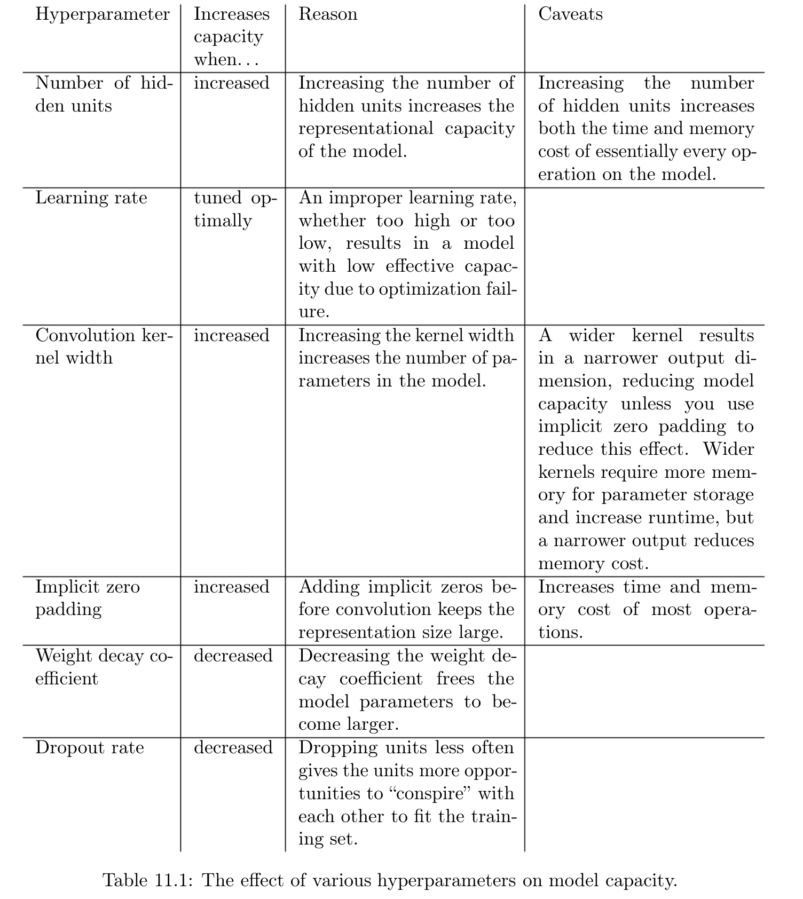

# Practical Methodologies
Practical design process (Ng., 2015):

- *Determine your goal*: What error metric to use and your target value for error metric based on the problem the application is intended to solve.
- *Establish an end-to-end working pipeline* as soon as possible, including appropriate performance metrics.
- *Instrument the system* to identify bottlenecks in performance. Determine overfitting, underfitting, or defect in data. 
- *Repeatedly make incremental changes*: Gather new data, tune hyperparameter or change new algorithms based on specific findings from instrumentation.

## Performance Metric
Determine the error metric and an appropriate level of performance. Zero error is impossible even if one has infinite training data. The input may not encode the complete information about the output variable. Usually, the performance is measured as the accuracy of equivalently the error rate of a system. In a spam detection system, incorrectly identifying a legitimate message as spam is much worse than allowing a questionable message to pass through.

When identifying rare events, it is important to use precision rather than accuracy (as it is easy to hard code a rare event as always absent, such as identifying a rare disease that occurs one in a million people, which would give an accuracy of 99.999%). *Precision (p)* is the fraction of detection reported by the model that was correct, while *recall (r)* is the fraction of true events that were detected. A detector that says no one has the disease all the time would achieve perfect precision and zero recall, while a detector that identifies everyone to have the disease would have zero precision and perfect recall. We typically use  an F-score to have a threshold: $F = \frac{2pr}{p+r}$. Coverage refers to the fraction of examples for which the ML system is able to produce a response. There is a trade-off between coverage and accuracy. 

## Default baseline models
Establish a reasonable end-to-end system as soon as possible. Depending on the complexity of the problem, one may even want to begin without deep learning. If the problem needs AI, first, choose the general category of the model based on the structure of your data. If the input is a fixed-size vector, use a fully connected feed-forward network. Input has known topological structure, use a CNN. In these cases, use piece-wise linear units ReLU or LeakyReLU or max out. If your input and output are a sequence, then use gated RNNs (LSTM or GRU).

A reasonable optimization algorithm is Stochastic Gradient Descent (SGD) with momentum with a decaying learning rate. Another reasonable optimization alternative is Adam. Batch normalization has dramatic effects on optimization performance especially for CNN and networks with sigmoid nonlinearity. 

Unless the training sample is in a million, use some form of regularization. Early stopping should be used universally. Dropout is an excellent regularization. Copying models to perform a similar task is a good process. Try unsupervised learning only if you observe the baseline overfits or if the task you want to solve is unsupervised. 

## Gather more data
After establishing an end-to-end system, it is time to measure the performance of the algorithm and determine how to improve it. If the performance on the training set is poor, the learning algorithm is not using the training data that is already available, so there is no reason to gather more data. Instead, try increasing the size of the model (add more layers or more hidden units) or try tuning the learning rate. If large models and carefully tuned learning rate, the problem might be the "quality" of training data.

If performance on the training set is acceptable, then measure the performance on a test set. If performance on the test set is also acceptable, nothing is left to be done. If test set performance is much worse than training set, then getting more data is one of the most effective solutions. When gathering large-data that is infeasible, the option is to reduce the size of the model or improve regularization by adjusting weight decay coefficients, adding regularization such as dropouts. After tuning, the gap between training and test data is still unacceptable, then gather more data. Plot the relation between training set size and generalization error. Use a long scale and double the number of samples in each new iteration.

## Tuning Hyperparameters
To set hyperparameter manually, one must understand the relation between hyperparameters, training error, generalization error, and compute resources (memory and runtime). The goal is to find the lowest generalization error subject to some runtime and memory budget. Manual tuning of hyperparameter is to adjust the capacity of the model. Effective capacity is constrained by three factors: the capacity of the model, the ability of the learning algorithm to minimize the cost function, and the degree to which cost function and learning process regularize the model. 

A model with more layers and more hidden units per layer has a higher representational capacity—it is capable of representing more complicated functions. It cannot necessarily learn all these functions, though, if the training algorithm cannot discover that certain functions do a good job of minimizing the training cost, or if regularization terms such as weight decay forbid some of these functions. 

The generalization error vs. hyperparameter follows a U-shaped curve. There are two regions: Underfitting (low capacity and large generalization error) and overfitting (high capacity and large generalization error). Somewhere in the middle is the optimal model capacity. Overfitting can occur when the value of the hyperparameter is large such as the number of hidden units in a layer or when the hyperparameter is small (small weight decay coefficient close to zero). 

Not every hyperparameter will be able to explore the entire U-shape. The number of units in a hidden layer or the number of piece-wise units in max out are discrete, and some parameters are binary, which restricts the exploration space of hyperparameters to a few points in the U-shaped curve. For example, if the weight decay function is zero and the model under fits, we cannot reach the overfitting region by changing the weight decay coefficient, as some hyperparameters can only subtract capacity. 

The effective capacity of the model is highest when the learning rate is *correct*. The learning rate is too large the gradient descent inadvertently increases rather than decreases the training error. When the learning rate is too small, training is not only slow but may become permanently stuck with a high training error. If the error rate in training is larger than the target error rate, one must increase the capacity. If you think the optimization algorithm performs correctly, you must increase the number of layers the number of hidden units, but this incurs higher computation cost. 

