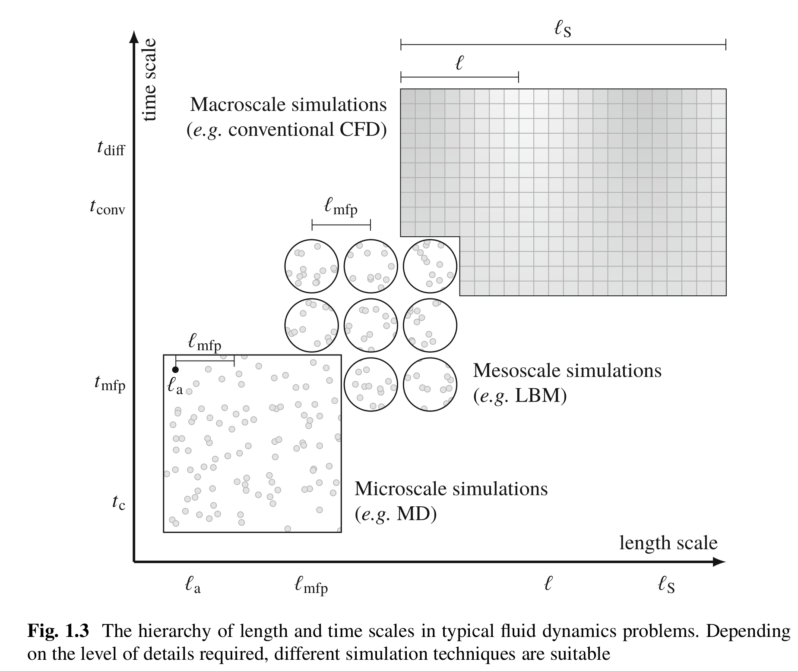

# Basics of Hydrodynamics
## Continuity Equation
Consider a small fluid element with density $\rho$, which occupies some stationary volume $v_0$. The mass of the element is $\int_{v_0} \rho dv$. If we consider the change of this mass per unit time, it must be due to fluid flowing in or out of the volume to conserve the mass of the system:

$$\frac{\partial}{\partial t} \int_{v_0} \rho dv = \oint_{\partial v_0} \rho u dA$$
where the close area integral is taken over the boundary $\partial v_0$, $u$ is the fluid velocity and outward normal as the direction of $dA$. Converting surface to volume integral using divergence theorem:

$$\int_{v_0} \frac{\partial \rho}{\partial t} = - \int_{v_0} \nabla \cdot (\rho u) dv$$

Since $v_0$ is stationary and arbitrary. The **continuity equation** reflects the conservation of mass as:

$$\frac{\partial \rho}{\partial t} + \nabla \cdot (\rho u) = 0$$

The vector $\rho u$ is the *momentum density* or *mass flux density*. 

$$\frac{\partial \rho}{\partial t} + u \cdot \nabla \rho + \rho \cdot \nabla u = 0 \quad or \quad \frac{D \rho}{Dt} + \rho \cdot \nabla u = 0$$

The material derivative $\frac{D}{Dt} = \frac{\partial}{\partial t} + u \cdot \nabla$ denotes the rate of change as the fluid element moves about in space, rather than the rate of change of $\frac{\partial}{\partial t}$ at a fixed point in space. 

## Navier-Stokes Equation (NSE)
For a simple ideal fluid, the change of net momentum can be due to: (i) flow of momentum into or out of element, (ii) difference in pressure $p$, and (iii) external body force. 

$$\frac{d}{dt}\int_{v_0} \rho u dt = \oint_{\partial v_0} (\rho u u) \cdot dA - \oint_{\partial v_0} p dA + \int_{v_0} F dv$$

Transforming surface to volume integrals using the divergence theorem:

$$\int_{v_0} \frac{d \rho u}{dt} dt = \int_{v_0} \nabla \cdot (\rho u u) dA - \int_{v_0} \nabla p dA + \int_{v_0} F dv$$

**Euler's equation** describes the *conservation of momentum*:

$$\frac{\partial (\rho u)}{\partial t} + \nabla \cdot (\rho u u) = - \nabla p + F$$

The Cauchy momentum equation is a general form of conservation of momentum.

$$\frac{\partial (\rho u)}{\partial t} + \nabla \cdot \Pi = F$$

The momentum flux density $\Pi_{\alpha \beta} = \rho u_\alpha u_\beta - \sigma_{\alpha\beta}$, where $\sigma_{\alpha\beta}$ is the stress tensor. For simple fluid in an isotropic stress $\sigma_{\alpha\beta} = - p \delta_{\alpha\beta}$. 

The momentum flux transfer in Euler's equation only refers to reversible momentum transfer either due to the flow of mass or pressure changes. Real fluids need a viscosity or inertial friction term, which is dissipative. 

The viscosity stress tensor in separated into a traceless shear stress and normal stress components. The coefficients $\eta$ and $\eta_B$ correspond to the shear viscosity and bulk viscosity, respectively. The total stress tensor is the sum of pressure and viscosity terms. $\sigma_{\alpha\beta} = \sigma_{\alpha\beta}^\prime - p \delta_{\alpha\beta}$. Using this stress tensor in Cauchy momentum equation, we derive the **Navier-Stokes Equation (NSE)**. If the flow is regarded as incompressible ($\rho=const$), the continuity equation reduces to $\nabla \cdot u = 0$, then the incompressible NSE:

$$\rho \frac{Du}{Dt} = -\nabla p + \eta \Delta u + F$$

$\Delta = \nabla \cdot \nabla = \frac{\partial^2}{\partial x_\alpha \partial x_\beta}$ is the Laplace operator. 

## Equation of State (EOS)
We have five unknowns (density $\rho$, pressure $p$, three components of velocities), but only four equations (continuity equation, which is the conservation of mass, and three components of momentum from either Navier-Stokes equation or Euler's equation). We can solve this by either fixing a variable, such as assuming incompressibility condition $\rho = const$) Alternatively, use an additional equation. 

*State principle of equilibrium thermodynamics* relates the state variables that describe the local thermodynamics state of the fluid, such as density $\rho$, the pressure $p$, temperature $T$, internal energy $e$, and entropy $s$. State principle declares any state variable can be related to any other two state variables through an equation of state (EOS). 

The most famous EOS is the *ideal gas law*: $p = \rho R T$, which relates the pressure to density and temperature through a specific gas constant $R$. Introducing an EOS adds a new variable, in this case, temperature $T$, and does not make our system solvable. Instead, introducing EOS allows us to make suitable approximations such as assuming fluid has a constant temperature ($T \approx T_0$), which is the isothermal condition that yields $p = \rho R T_0$. 

Another EOS for an ideal gas is the expression of pressure as a function of density and entropy. 

$$\frac{p}{p_0} = \left(\frac{\rho}{\rho_0}\right)^\gamma e^{(s-s_0)/c_v}$$

$c_v$ and $c_p$ are heat capacities at constant volume and pressure, respectively and $gamma = \frac{c_v}{c_p}$ is the *adiabatic index*. For small derivatives, this equation can be linearized: $p = p_0 +p^\prime \approx p_o + \left(\frac{\partial p}{\partial \rho}\right)_p p^\prime + \left(\frac{\partial p}{\partial \rho}\right)_s s^\prime$.

For isentropic EOS, $p \approx p_0 + c_s^2 \rho^\prime$, since speed of sound $c_s$ is in general given by $c_s^2 = \left(\frac{\partial p}{\partial \rho}\right)_s$. For isentropic and isothermal EOS, we find $c_s = \sqrt{\gamma R T}$ and $c_s = \sqrt{RT_0}$, respectively. The constant reference pressure $p_0$ is insignificant to NSE as only pressure gradient $\nabla p = \nabla (p_0 + p^\prime) = \nabla p^\prime$ is present. Therefore the isothermal EOS is $p = c_s^2 \rho \rightarrow c_s^2 \rho_0 + c_s^2 \rho^\prime$ can be used to model EOS in the linear regime where entopy is nearly constant, as long as speed of sound is matched, it does not matter if the reference pressure $p_0$ is different. 

# Relevant Scales
Continuum assumption operates at length and time scales sufficiently large that the atomistic picture can be averaged out. Microscopic refers to a molecular description, and macroscopic denotes a full continuum picture with tangible quantities such as fluid velocity and density. The microscopic scale is governed by Newton's dynamics, while the NSE is the governing equation in the continuum scale. The mesoscopic description is between micro and macro scale. Mesoscale does not track individual molecules, rather the distribution or representative collection of molecules described using the kinetic theory. 

Length scales are defined from small to large: (i) size of fluid atom or molecule $l_a$, (ii) mean free path, distance between two successive collisions $l_{mfp}$, (iii) typical scale for gradients in macroscopic properties $l$, and (iv) system size $l_s$. Similarly, the time scales are: (i) collision time $t_c \sim l_a / v_T$, duration of a collision event, and $v_T$ is the average thermal velocity of molecules. In LBM's standard kinetic theory, collision is assumed to be instantaneous $t_c = 0$. Thermal velocity $v_T$ is different from macroscopic fluid velocity $u << v_T$. (ii) Mean flight time between two successive collisions, $t_{mfp} = l_{mfp}/v_T$, this is the timescale at which LBM operates, where the system relaxes to local equilibrium through collision events. Local equilibrium does not mean the system is in global equilibrium. 

At longer time and larger length scales dominated by hydrodynamic flow from one region of fluid to another, depending on if we have advection (inertial regimes $t_{conv} \sim l/u$) or diffusion (viscous regime $t_{diff} \sim l^2/\nu$) dynamics. The kinematic viscosity $\nu$ is related to the dynamic shear viscosity $\eta = \rho \nu$. The ratio between the two dynamic scales is the **Reynold's number**, which measures the relative inertial to the viscous regime in the NSE. 

$$R_e = \frac{t_{diff}}{t_{conv}} = \frac{u l}{\nu}$$

Another important time scale is the acoustic time scale $t_{sound} \sim l/c_s$, where $c_s$ is the speed of sound in the fluid. The acoustic timescale determines how fast compression waves propagate in the fluid. When acoustic time is fast in comparison to the advection time scale, the fluid behaves as incompressible. Otherwise, compressibility becomes important. The **Mach number** defines the ratio between acoustic and advective time scales:

$$ Ma = \frac{t_{sound}}{t_{conv}} = \frac{u}{c_s}$$

In practice, for a steady fluid flow with $Ma < 0.1$, the flow is assumed to be incompressible. Fluid flows that share the same dimensionless number provide the same physics upon a simple scaling by typical length and velocity scales. This is called the *law of similarity*.

## Kinetic theory
The mesoscopic kinetic theory describes the distribution of particles in a gas, which evolves on a timescale around the mean collision time $t_{mfp}$. Kinetic theory is often used to describe dilute gas as the constituent molecules spend very little time colliding ($t_c << t_{mfp}$), which assumes only binary collisions (one-to-one). This binary collision assumption does not hold for dense gases. 

The kinetic theory of dilute monatomic gases describes a system where single atoms collide elastically (translation energy is conserved). On the other hand, molecules have internal degrees of freedom (rotational and vibrational energy), which leads to inelastic (translational to rotational and vibrational energy) or superelastic (rotational and vibrational energy to translational energy) collisions. However, the total energy is always conserved. 

The quantum behavior of a system reduces to classical behavior when the system becomes large enough.

### Distribution functions and their moments
The fundamental variable in kinetic theory is the particle distribution function $f(x, \xi, t)$, which can be thoght of as a generalization of density $\rho(x, t)$ that reprents density of mass in physical space. $f(x, \xi, t)$ represent density of mass in both three-dimensional physical space and three-dimensional velocity space. $f$ has units of $kg \cdot \frac{1}{m^3} \cdot \frac{1}{(m/s)^3} = \frac{kg \cdot s^3}{m^6}$. $f(x, \xi, t)$ reresents density of particles with velocity $\xi(\xi_x, \xi_y, \xi_z)$ at position $x$ and time $t$. 

The distribution function $f$ is also connected to macroscopic varibale like the density $\rho$ and fluid velocity $u$ from its moments, which are integrals of $f$ weighted with the same function of $\xi$ over entire velocity space. The macroscopic mass density:

$$\rho(x, t) = \int f(x, \xi, t) d^3 \xi$$

which integrates the density of particles of all possible velocities at position $x$ and time $t$. Similarly considering the particle contribution $\xi f$ to momentum density for all possible velocity we get macroscopic momentum density:

$$\rho(x, t) u(x, t) = \int \xi f(x, \xi, t) d^3 \xi$$

The total energy density:

$$\rho(x, t) E(x, t) = \frac{1}{2}\int |\xi|^2 f(x, \xi, t) d^3 \xi$$

Which contains the energy $\frac{1}{2}\rho|u|^2$ due to both motion of fluid and internal energy due to thermal motion of the gas. 

Internal energy density as the moment:

$$\rho(x, t) e(x, t) = \frac{1}{2}\int |v|^2 f(x, \xi, t) d^3 \xi$$

Relative velocity $v(x, t) = \xi (x, t) - u(x, t)$. These energy only consider the transnational energy of the molecules, energy due to moment with their velocity $\xi$. 

To write pressure as a function of momentum, we consider that particles impart momentum when bouncing off a surface. At higher particle velocities, more momentum is imparted, more particles can bounce off in a given time. 

There are three degrees of freedom: molecular translation, vibration, and rotation. For monatomic gases with no internal structure, there is only translation and no vibration or rotation component. Using the ideal gas equation:

$$ \rho e = \frac{3}{2} \rho RT = \frac{3}{2}p$$ 

Consequently, both the pressure and temperature can be found proportional through the same moment as internal energy:

$$ p = \rho R T = \frac{2}{3} \rho e = \frac{1}{3}\int |v|^2 f(x, \xi, t) d^3 \xi$$

### Equilibrium distribution function
The outgoing direction of two elastically colliding hard spheres is very sensitivie to their initial relative positions. Collision tend to even out the angular distribution  of particle velocities in a gas around the mean velocity $u$. Consequently, wehn a gas is left alone for sufficiently long, we may assume the distribution function $f(\xi, t)$ may reach an equilibrium distribution $f^{eq}(x, \xi, t)$, which is isotropic in velocity space around $\xi = u$, in a reference frame moving with velocity $u$. The equilibrium distribution function can be expressed as $f^{eq}(x, |v|, t)$. If we assume the solution is in a separable form: $|v|^2 = v_x^2 + v_y^2 + v_z^2 = const$. Given, $f^{1D}(v_x^2) = a + b v_x^2$:  

$$f^{eq}(|v|^2) = f^{1D}(v_x^2)f^{1D}(v_y^2)f^{1D}(v_z^2) = \exp^{3a + b (v_x^2+v_y^2+v_z^2)} = \exp^{3a} \cdot \exp^{b|v|^2}$$

Since monatomic collision conserves mass, momentum, and energy, constants $a$ and $b$ can be found explicitly by demanding that $f^{eq}$ has the same moments of density and energy as $f$. 

## Boltzmann equation and collision operator
Since $f(x, \xi, t)$ is a function of position $x$, particle velocity $\xi$ and time $t$:

$$\frac{df}{dt} = \left(\frac{\partial f}{\partial t}\right)\cdot\frac{dt}{dt} + \left(\frac{\partial f}{\partial x_\beta}\right)\cdot\frac{dx_\beta}{dt} + \left(\frac{\partial f}{\partial \xi_\beta}\right)\cdot\frac{d\xi_\beta}{dt}$$

From Newton's law, $\frac{d \xi_\beta}{dt} = acc = F_\beta/\rho$, the rate of change of position is velocity $\frac{d\xi_\beta}{dt} = \xi_\beta$  and using $\Omega(f) = \frac{df}{dt}$ for the total differential we get the **Boltzmann equation**:
[#boltzmann-equation]
$$\left(\frac{\partial f}{\partial t}\right) + \xi_\beta\left(\frac{\partial f}{\partial x_\beta}\right) + \frac{F_\beta}{\rho}\left(\frac{\partial f}{\partial \xi_\beta}\right)=\Omega(f)$$

$\Omega(f)$ is the collision operator. This is like an advection equation. The first two terms represent the distribution function being advected with velocity $\xi$ of its particles. The third term represents the forces affecting this velocity. The right-hand side is the source term representing the local distribution of $f$ due to collision. 

Collision conserves mass, momentum and translational energy in monatomic conditions:

Mass conservation: $\int \Omega(f)d^3\xi = 0$

Momentum conservation: $\int \xi \Omega(f)d^3\xi = 0$

Total energy conservation: $\int |\xi|^2 \Omega(f)d^3\xi = 0$

Internal energy conservation: $\int |v|^2 \Omega(f)d^3\xi = 0$

The Bhatnagar, Gross ad Krook (BGK) collision operator directly captures the relaxation of distribution function towards one equilibrium distribution: 

$$\Omega(f) = -\frac{1}{\tau}(f - f^{eq})$$

The time constant $\tau$, which determines the speed of equilibrium, is the relaxation time. Values of $\tau$ determine the transport coefficient, such as viscosity and heat diffusivity. The simplified BGK predicts a Prandtl number, as the ratio of viscosity to the thermal conductivity of 1. Whereas the Boltzmann operator, which considers all possible values of two-particle collision for any choice of intermolecular forces using a double integration over the velocity space, predicts a Pr = 2/3, which is much closer to lab observations.

## Macroscopic conservation

Macroscopic conservation equation of fluid mechanics can be obtained directly from Boltzmann equation by taking the moments of the equation:

$$\Pi_0 = \int f d^3 \xi = \rho$$
$$\Pi_1 = \int \xi_\alpha f d^3 \xi = \rho u_\alpha$$
$$\Pi_{\alpha\beta} = \int \xi_\alpha\xi_\beta f d^3 \xi$$
$$\Pi_{\alpha\beta\gamma} = \int \xi_\alpha\xi_\beta\xi_\gamma f d^3 \xi$$

Moments of force terms:
$$\int \frac{df}{d\xi_beta}d^3\xi =0$$
$$\int \xi_\alpha \frac{df}{d\xi_beta}d^3\xi = -\rho \delta_{\alpha\beta}$$
$$\int \xi_\alpha \xi_\beta \frac{df}{d\xi_beta}d^3\xi = -2 \rho u_\beta$$

### Mass conservation
Continuity equation, which describes the conservation of mass, is obtained by integrating the Boltzmann equation:

$$\frac{\partial}{\partial t} \int f d^3\xi + \frac{\partial}{\partial x_\beta} \int \xi_\beta f d^3\xi + \frac{F_\beta}{\rho}\int\frac{\partial f}{\partial \xi_\beta} d^3\xi = \int \Omega (f) d^3 \xi$$

Considering the collision operator conserves mass and the above macroscopic conservation quantities, we get:

$$\frac{\partial \rho}{\partial t} + \frac{\partial (\rho u_\beta)}{\partial x_\beta} = 0$$

The equation only depends on $\rho$ and $\rho u_\beta$ and not $f$. 

### Momentum conservation
If we take the first moment of Boltzmann equation:
$$\frac{\partial \rho u_\alpha}{\partial t} + \frac{\partial (\Pi_{\alpha\beta}}{\partial x_\beta} = F_\alpha$$

$\Pi_{\alpha\beta}$ is the *momentum flux tensor*.

### Energy conservation
Energy conservation can be obtained from the trace of second moments. In other words, we multiply by $\xi_\alpha\xi_\alpha$ before integrating over velocity space: 

$$\frac{\partial \rho E}{\partial t} + \frac{1}{2}\frac{\partial (\Pi_{\alpha\alpha\beta}}{\partial x_\beta} = F_\alpha u_\beta$$

## Boltzmann $\mathcal{H}$-Theorem
The thermodynamic property of entropy can be related to the distribution function $f$. The entropy density is denoted by $\rho s$ with units of $J/kg m^3$. 

$$\mathcal{H} = \int f \ln f d^3 \xi$$

$\mathcal{H}$ can only ever decrease and reaches its minimum value when the distribution function $f$ reaches equilibrium. The flux of quantity $\mathcal{H}$ is $\mathcal{H}_\alpha = \int \xi_\alpha f \ln f d^3 \xi$, which can be split into advection and diffusion components. From the Boltzmann equation:

$$\frac{\partial \mathcal{H}}{\partial t} + \frac{\partial \mathcal{H}_\alpha}{\partial x_\alpha} = 0$$

$\mathcal{H}$ is not conserved in the system: it never increases but instead, it decreases until the particle distribution reaches equilibrium. This is the **Boltzmann $\mathcal{H}$-theorem**. Molecular collisions invariable drive the distribution function towards equilibrium.

$\mathcal{H}$ is proportional to entropy distribution $\rho s$ as $\rho s = -R \mathcal{H}$. This is analogous to how entropy always increases in the system unless the system has reached an equilibrium characterized by an entropy maximum.
