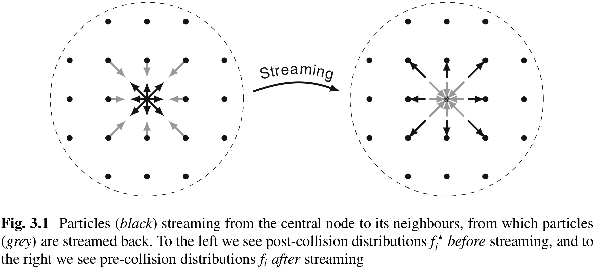

# Lattice Boltzmann Method (LBM)
The Boltzmann equation represents the dynamics of the fluid on the macroscale and is described using the fundamental variable - its distribution function $f(x, \xi, t)$. The solution to the Boltzmann equation may often yield a solution to the Navier-Stokes equation. The force-free Boltzmann equation is a hyperbolic equation that describes the advection of distribution function $f$, with particular velocity $\xi$. The source term $\Omega (f)$ depends only on the local values of $f$ and not on its gradients. Traditional CFD requires an iterative approach to solve the nonlinear advection term $(u \cdot \nabla) u$, and this introduces numerical approximation errors. In contrast, discretized Boltzmann equation uses a very different approach that yields the exact advection term. 

## Overview
The basic quantity of the LBM is the *discrete velocity distribution functions* $f_i(x, t)$ often called particle populations. It represents desnity of particles with velocity $c_i = (c_{ix}, c_{iy}, c_{iz})$ at position $x$ and time $t$. The mass and momentum of $f_i$: $\rho (x, t) = \sum_i f_i(x, t) \quad \rho u(x, t) = \sum_i c_i f_i(x, t)$. The major difference between $f_i$ and continuous distribution function $f$ is that all of the argument variables of $f_i$ are discrete. $c_i$ are small discrete set of velocities. The point $x$ at which $f_i$ is defined are positioned on a square lattice in space with lattice spacing $\Delta x$. Additionally, $f_i$ is defined only at certain times $t$, separated by a time step $\Delta t$. The time step $\Delta t$ and lattice spacing $\Delta x$ represent time and space resolution. 

Velocity sets $\{c_i, w_i\}$, where $w_i$ is a weighting coefficient, are used to solve the Navier-Stokes equation. D1Q3, D2Q9, D3Q15, D3Q19, and D3Q27 are typical velocity sets. There is a trade-off between using smaller velocity sets for low memory consumption and higher accuracy of large velocity sets.

In isothermal LBE, the equation $p = c_s^2 \rho$ describes the relationship between the pressure $p$ and density $\rho$. Therefore, $c_s$ represents the isothermal model's speed of sound. In all velocity sets, $c_s^2 = (1/3) (\Delta x/\Delta t)^2$ is constant. By discretizing the Boltzmann equation in velocity and space, we get the Lattice Boltzmann equation:

$$f_i(x + c_i \Delta t, t+\Delta t) = f_i (x, t) + \Omega_i (x, t)$$

Particles $f_i(x, t)$ move with velocities $c_i$ to a neighboring point $x + c_i \Delta t$ at the next time step $t + \Delta t$. The collision operator $\Omega_i$ modes particle collision by redistributing particles among the population $f_i$ at each site. 

The Bhatnagar-Gross-Krook (BGK) collision operator:
$$\Omega_i (f) = - \frac{f_i - f_i^{eq}}{\tau} \Delta t$$
relaxes the population towards an equilibrium from $f_i^{eq}$ at a rate determined by the relaxation time. The equilibrium is given by:
$$f_i^{eq}(x, t) = w_i \rho \left(1 + \frac{u \cdot c_i}{c_s^2} +  \frac{(u \cdot c_i)^2}{2c_s^4} -  \frac{u \cdot u}{2c_s^2}\right)$$
$w_i$ weights specific to the velocity sets. The equilibrium is such that the moments are the same as $f_i$, i.e., $\sum_i f_i^{eq} = \sum_i f_i = \rho$ and $\sum_i c_i f_i^{eq} = \sum_i c_i f_i = \rho u$. The equilibrium $f_i^{eq}$ depends on the local quantities, density $\rho$ and fluid velocity $u (x, t) = \rho u (x, t) / \rho(x, t)$. 

Chapman-Enskog analysis links the Lattice Boltzmann Equation to the Navier Stokes Equation which results in macroscopic behavior, with the kinetic shear viscosity given by relaxation time $\tau$: $\nu = c_s^2 (\tau - \frac{\Delta t}{2})$, kinematic bulk viscosity $\nu_B = 2/3 \nu$, and viscous stress tensor $\sigma_{\alpha \beta} \approx - (1 - \frac{\Delta t}{2 \tau} \sum_i c_{i\alpha} c_{i \beta} f_i^{neq})$. The non-equilibrium $f_i^{neq} = f_i - f_i^{eq}$, is the deviation of $f_i$ from equilibrium. 

### LGBK
The LGBK equation is given as:
$$f_i(x + c_i \Delta t, t + \Delta t) = f_i (x, t) - \frac{\Delta t}{\tau} (f_i (x, t) - f_i^{eq} (x, t))$$
The LBE consists of two parts: *collision* and *streaming*. Collision is an algebraic local operation, which calculates the density $\rho$ and macroscopic velocity $u$ to find out the equilibrium distribution $f_i^{eq}$ and the post collision distribution $f_i^*$:

$$f_i^*(x, t) = f_i(x, t) (1-\frac{\Delta t}{\tau}) + f_i^{eq} (x, t) \frac{\Delta t}{\tau}$$

When $\delta t / \tau = 1$, we get $f^*_i = f_i^{eq}$. After collision, we *stream* the resulting distribution function $f^*$ to neighboring nodes. A single time step involves both these operations. 

$$f_i(x + c_i \Delta t, t + \Delta t)= f_i^*(x, t)$$

### Algorithm
0. Initialize population as $f_i^{eq}(x, t = 0) = f_i^{eq}(\rho (x, t=0), u(x, t=0))$, density as $\rho(x, t= 0) = 1$ and velocity is zero $u(x, t =0) = 0$. 
1. Compute macroscopic moment $\rho(x, t)$ and $u(x, t)$ from $f_i(x, t)$. 
2. Obtain equilibrium distribution function $f_i^{eq}(x, t) = w_i \rho \left(1 + \frac{u \cdot c_i}{c_s^2} +  \frac{(u \cdot c_i)^2}{2c_s^4} -  \frac{u \cdot u}{2c_s^2}\right)$.
3. Perform *collision* (relaxation): $f_i^*(x, t) = f_i(x, t) (1-\frac{\Delta t}{\tau}) + f_i^{eq} (x, t) \frac{\Delta t}{\tau}$
4. Perform *streaming*: $f_i(x + c_i \Delta t, t + \Delta t)= f_i^*(x, t)$
5. Increase time step $t$ to $t + \Delta t$ and repeat from step 1. 

## Discretization in velocity space
Discretization in velocity space allows us to reduce the continuous 3D velocity space to a small number of discrete velocities without compromising the validity of macroscopic equations. 

In contrast to the unknown distribution function $f$ the equilibrium distribution function $f^{eq}$ is known function of exponential form. $f^{eq}$ can be represented through the exponential weight function. The mass and momentum can be represented as integral of $f^{eq}$ multiplied by Hermite polynomial. 

The Boltzmann equation is:  [#boltzmann-equation]
$$\left(\frac{\partial f}{\partial t}\right) + \xi_\alpha\left(\frac{\partial f}{\partial x_\alpha}\right) + \frac{F_\alpha}{\rho}\left(\frac{\partial f}{\partial \xi_\alpha}\right)=\Omega(f)$$

The Boltzmann equation describes the  evolution of the distribution function $f(x, \xi, t)$, i.e., density of particle with velocity $\xi$ at position $x$ and time $t$. In a force-free homogeneous steady state, the left-hand side disappears, and the solution of the Boltzmann equation is $f^{eq}$. $f^{eq}$ is written in terms of macroscopic quantities: density $\rho$, fluid velocity $u$, and temperature $T$. 

$$f^{eq}(\rho, u, T, \xi) = \frac{\rho}{(2\pi R T)^{d/2}} e^{-(\xi -u)^2/2RT}$$

where, $d$ is the number of spatial dimensions, gas constant $R = k_\beta / m$, $k_\beta$ is the Boltzmann constant and $m$ is the particle mass. 

Physical pheomena occurs at certain characteristic scales. Such as length $l$, velocity $V$, and density $\rho_0$. A characteristic time scale is $t_0 = l/V$. Using $*$ to denote non-dimensional quantities. 

$$\frac{\partial}{\partial t^*} = \frac{l}{v}\frac{\partial}{\partial t};  \quad \frac{\partial}{\partial x^*} = l\frac{\partial}{\partial x}; \quad \frac{\partial}{\partial \xi^*} = v\frac{\partial}{\partial \xi};$$

Non-dimensional Boltzmann equation:
$$\left(\frac{\partial f^*}{\partial t^*}\right) + \xi_\alpha^*\left(\frac{\partial f^*}{\partial x_\alpha^*}\right) + \frac{F_\alpha^*}{\rho^*}\left(\frac{\partial f^*}{\partial \xi_\alpha^*}\right)=\Omega^*(f^*)$$

$$f^* = f V d/\rho_0, \quad \quad F^* = F l / (\rho V^2)  \quad \quad \rho^* = \rho/\rho_0, \quad \quad \Omega^* = \Omega l V^2/\rho_0  \quad \quad \theta^* = RT/V^2$$

We will omit $^*$ to refer to Boltzmann equation in non-dimensional form. Force-free continuous Boltzmann equation is:
$$\left(\frac{\partial f}{\partial t}\right) + \xi_\alpha\left(\frac{\partial f}{\partial x_\alpha}\right) + =\Omega(f)$$

Conservation implies momentum of equilibrium distribution function $f^{eq}$ and particle distribution function $f$ coincide:

$$\int f(x, \xi, t)d^3\xi = \int f^{eq} (\rho, u, \theta, \xi) = \rho(x, t)$$
$$\int f(x, \xi, t) \xi d^3\xi = \int f^{eq} (\rho, u, \theta, \xi) \xi = \rho u(x, t)$$
$$\int f(x, \xi, t) \frac{|\xi|^2}{2}d^3\xi = \int f^{eq} (\rho, u, \theta, \xi)\frac{|\xi|^2}{2} = \rho E(x, t)$$
$$\int f(x, \xi, t)\frac{|\xi - u|^2}{2}d^3\xi = \int f^{eq} (\rho, u, \theta, \xi) \frac{|\xi-u|^2}{2}= \rho e(x, t)$$

The dependence on space and time in $f^{eq}$ enters only through $\rho(x, t)$, $u(x, t)$ and $\theta(x, t)$. 

**The idea of the Hermite series is to take the continuous integral to discrete sums evaluated at a particular velocity space (for specific values of $\xi$).**

## Hermite Polynomials (HP)
1D HP can be obtained from the *weight function* (also called the *generating function*):

$$\omega(x) = \frac{1}{\sqrt{2\pi}}e^{-x^2/2}$$

The weighting function allows us to construct 1D HP of n-th order ($n \ge 0$):

$$H^n(x) = (-1)^n \frac{1}{\omega(x)}\frac{d^n}{dx^n}\omega(x)$$

For different values of $n$:
$$H^{(0)}(x) = 1 \quad H^{(1)}(x) = x  \quad H^{(2)}(x) = x^2 -1  \quad H^{(3)}(x) = x^3 - 3x$$

For d-spatial dimensions:
$$H^n(x) = (-1)^n \frac{1}{\omega(x)}\nabla^{(n)}\omega(x) \quad \omega(x) = \frac{1}{(2\pi)^{d/2}}e^{-x^2/2}$$

$H^n$ and $\nabla^n$ has $d^n$ components: $\nabla^{(n)}_{\alpha_1, \dots \alpha_n} = \frac{\partial}{\partial x_{\alpha_1}}\dots\frac{\partial}{\partial x_{\alpha_n}}$

Derivatives are commutative: $\nabla_{xxy}^3 = \nabla_{xyx}^3 = \nabla_{yxx}^3$. We deal with $d = 2$ or $3$. $a_1, \dots a_n \in \{x, y\}$ or $\{x, y, z\}$. 

For $d=2$. HP up to second order ($n = 0, 1, 2$):
$$\nabla_{xx}^2 = \frac{\partial}{\partial x}\frac{\partial}{\partial x} \quad \nabla_{xy}^2 = \frac{\partial}{\partial x}\frac{\partial}{\partial y} \quad \nabla_{yx}^2 = \frac{\partial}{\partial y}\frac{\partial}{\partial x} \quad \nabla_{yy}^2 = \frac{\partial}{\partial y}\frac{\partial}{\partial y}$$

For $n = 0$:
$$H^{(0)} = 1$$
For $n = 1$:
$$H^{(1)}_x = - \frac{1}{e^{-(x^2 + y^2)/2}} \partial_x e^{-(x^2 + y^2)/2} = x$$
$$H^{(1)}_y = - \frac{1}{e^{-(x^2 + y^2)/2}} \partial_y e^{-(x^2 + y^2)/2} = x$$
For $n = 2$:
$$H^{(2)}_{xx} = - \frac{1}{e^{-(x^2 + y^2)/2}} \partial_x \partial_x e^{-(x^2 + y^2)/2} = x^2 -1$$
$$H^{(2)}_{xy} = H^{(2)}_{yx} = - \frac{1}{e^{-(x^2 + y^2)/2}} \partial_x \partial_y e^{-(x^2 + y^2)/2} = xy$$
$$H^{(2)}_{yy} = - \frac{1}{e^{-(x^2 + y^2)/2}} \partial_y \partial_y e^{-(x^2 + y^2)/2} = y^2 -1$$

### Orthogonality
In 1D, Hermite Polynomials are orthogonal with respect to $\omega(x)$:

$$\int_{-\infty}^{\infty}\omega(x)H^{(n)}(x)H^{(n)}(x) dx = n! \delta_{nm}^{(2)}$$

$\delta_{nm}^{(2)}$ is the Kronecker delta, for $d$ spatial dimensions

$$\int \omega(x) H_\alpha^{(n)}(x)H^{(n)}(x) d^d x = \prod_{i=1}^d n_i! \delta_{nm}^{(2)}\delta_{\alpha\beta}^{(n+m)}$$

For a 3D spatial dimension
$$\int \omega(x) H_\alpha^{(n)}(x)H^{(n)}(x) d^3 x = n_x! n_y! n_z! \delta_{nm}^{(2)}\delta_{\alpha\beta}^{(n+m)}$$

$n_x, n_y, n_z$ are number of occurrences of $x, y, z$ in $\alpha$. For, $\alpha = (x, x, y)$ we get $n_x = 2, n_y = 1, n_z = 0$. 

1D HP forms a complete basis in $\mathbb{R}$, i.e., any sufficiently well behaved continuous function $f(x)\in\mathbb{R}$ is represented as:

$$f(x) = \omega(x)\sum_{n=0}^{\infty}\frac{1}{n!}a^{(n)}\cdot H^{(n)}(x), \quad a^{(n)} = \int f(x)H^{(n)}(x)d^d x$$

### Hermite series expansion of equilibrium distribution
$$f^{eq}(\rho, u, \theta, \xi) = \omega(\xi)\sum_{n=0}^{\infty}\frac{1}{n!} a^{(n), eq}(\rho, u, \theta) \cdot H^{(n)}(\xi)$$
$$a^{(n), eq}(\rho, u, theta) = \int f^{eq}(\rho, u, \theta, \xi)H^{(n)}\xi d^d \xi$$

The equilibrium distribution function $f^{eq}(\xi)$ has the same form as weight function $\omega(\xi)$ of the HP:

$$f^{eq}(\rho, u, \theta, \xi) = \frac{\rho}{(2\pi\theta)^{d/2}}e^{-(\xi -u)^2/2\theta} = \frac{\rho}{\theta^{d/2}}\omega\left(\frac{\xi - u}{\sqrt{\theta}}\right)$$

$$a^{(n), eq} = \frac{\rho}{\theta^{d/2}} \int \omega\left(\frac{\xi - u}{\sqrt{\theta}}\right) H^{(n)}(\xi)d^d \xi$$

where $\eta = (\xi -u)/\sqrt{\theta}$:

$$a^{(n), eq} = \rho \int \omega (\eta) H^{(n)}(\sqrt{\theta} \eta + u )d^d \xi$$

The integrals can be directly computed:

$a^{(0), eq} = \rho \quad \quad  a_\alpha^{(1), eq} = \rho u_\alpha \quad \quad a_{\alpha\beta}^{(2), eq} = \rho (u_{\alpha}u_\beta + (\theta - 1)\delta_{\alpha\beta})$
$a_{\alpha\beta\gamma}^{(3), eq} = \rho (u_{\alpha}u_\beta u_\gamma + (\theta - 1)(\delta_{\alpha\beta}u_\gamma+\delta_{\beta\gamma}u_\alpha+\delta_{\gamma\alpha}u_\beta)$
The coefficients in the Hermite series expansion of $f^{eq}$ are related to conserved quantities: mass and momentum. To reproduce the relevant physics, i.e., to satisfy the conservation laws on the macroscopic level one does not need to consider the full mesoscopic equations and particle distribution functions. Instead, the first three terms of the Hermite series expansion are sufficient to reconstruct the macroscopic laws of hydrodynamics.

The distribution function is written as: $f^{eq}(\xi)\approx \omega(\xi)\sum_{n=0}^N \frac{1}{n!}a^{(n),eq}H^{(n)}(\xi)$

Considering up to the third moment: 
$$f^{eq}(\xi)\approx \omega(\xi)\rho[1+ \xi_\alpha u_\alpha + (u_{\alpha}u_\beta + (\theta - 1)\delta_{\alpha\beta})(\xi_\alpha\xi_\beta - \delta_{\alpha\beta})] = \omega(\xi)\rho Q(u, \theta, \xi)$$

The Mach number expansion matches with Hermite expansion up to second order in $u$. At higher order, they give different results. Due to orthogonality, Hermite expansion does not mix lower-order moments related to NSE with higher-order moments related to the energy equation and beyond. This is not the case for the Mach number expansion, so Hermite expansion is preferred. Hermite series also readily provides discrete velocity sets. We fully discretize the velocity space by replacing the continuous $\xi$ with a suitable set of discrete velocities $(\xi)$.

## Discretization
Hermite weight function $\omega(\xi)$ has the same form as the equilibrium distribution function $f^{eq}(\xi)$. It is possible to numerically integrate the function values by taking the weighted sum at a small number of discrete points. The *Gauss-Hermite quadrature*: 

$$\int_{-\infty}^\infty p^{(N)}(x)d^d x = \sum_{i=1}^n w_i P^{(N)}(x_i)$$

The equilibrium function is: 
$$a^{(n), eq} = \rho \int \omega (\eta) H^{(n)}(\sqrt{\theta} \eta, u )d^d \eta = \rho \int \omega(\eta)P^{(n)}(\eta) d^d \eta$$

$H^{(n)}(\eta)$ is a polynomial of order $n$, we write it as $P^{(n)}(\eta)$. We use a much simpler truncated series expansion to derive the discretized Hermite series:

$$a^{(n), eq} = \int f^{eq}(\xi) H^{(n)}(\xi) d^d \xi = \rho \int \omega (\eta) Q(\xi) H^{(n)}(\xi)d^d \xi = \rho \sum_{i=1}^n \omega_i Q(\xi_i) H^{(n)}(\xi_i)$$

If the polynomial $Q(\xi)$ is second order, then $R(\xi) = Q(\xi)H^{(2)}(\xi)$ is 4th-order. We need at least $n=3$ to numerically integrate the moments exactly. Instead of having a continuous function $f^{eq}(\xi)$, we only consider a finite set of $f_i^{eq} = f^{eq}(\xi_i)$:

$$f_i^{eq} = \omega_i\rho[1+ \xi_{i\alpha} u_\alpha + (u_{\alpha}u_\beta + (\theta - 1)\delta_{\alpha\beta})(\xi_{i\alpha}\xi_{i\beta} - \delta_{\alpha\beta})]$$

The discrete set $f^{eq}(\xi_i)$ satisfies the exact conservation laws for the first three moments (density, momentum and energy) as the continuous equilibrium function $f^{eq}(\xi)$. This discretized equation is still continuous in space and time because of $\rho(x, t), u(x, t) and \theta(x, t)$. Assuming isothermal condition $\theta = 1$, removes the temperature term from the equilibrium distribution. Introducing a new particle velocity, $c_i = \xi_i / \sqrt{3}$, yields integer abscissa. 

$$f_i^{eq} = \omega_i \rho \{1 + \frac{c_{i\alpha}u_\alpha}{c_s^2} + \frac{u_\alpha u_\beta (c_{i\alpha}c_{i\beta} - c_s^2 \delta_{\alpha\beta})}{2c_s^4}\}$$

Where $c_s$ is the speed of sound.

The discrete-velocity of Boltzmann equation is:
$$\partial_i f_i + c_{i\alpha}\partial_\alpha f_i = \Omega(f_i) \quad i = 1, \dots q$$

Macroscopic moment (density and momentum) are computed from finite sums:
$\rho = \sum_i f_i = \sum_i f_i^{eq}, \quad \rho u = \sum_i f_i c_i= \sum_i f_i^{eq} c_i$

## Velocity sets
What discrete velocity sets $\{c_i\}$ to choose? We need appropriate velocity sets to solve the NSE while keeping the computational cost low. We name each velocity set by its number $d$ of spatial dimensions and number $q$ of discrete velocities using $DdQq$ notation (D2Q9 has 9-discrete velocities in 2D). The velocity set is fully defined by two sets of quantities: velocities $\{c_i\}$ and the corresponding weights $\{w_i\}$, both together yield the speed of sound $c_s$. Most velocity sets have a rest velocity of zero magnitude to represent the stationary particle (typically at index 0). 

When LB is used to solve the NSE one requires all moments of weights $w_i$ up to fifth-order to be isotropic. Additionally, all weights $w_i$ have to be non-negative:

$\sum_i w_i = 1 \quad \sum_i w_i c_{i\alpha} = 0 \quad \sum_i w_i c_{i\alpha} c_{i\beta} = c_s^2 \delta_{\alpha\beta}$
$\sum_i w_i c_{i\alpha}c_{i\beta}c_{i\gamma} = 0$
$\sum_i w_i c_{i\alpha}c_{i\beta}c_{i\gamma}c_{i\mu} = c_s^4(\delta_{\alpha\beta}\delta_{\gamma\mu} + \delta_{\alpha\gamma}\delta_{\beta\mu} + \delta_{\alpha\mu}\delta_{\beta\gamma})$
$\sum_i w_i c_{i\alpha}c_{i\beta}c_{i\gamma}c_{i\mu}c_{i\nu} = 0$

Velocity set $\{c_i\}$ and weights $w_i$ must satisfy the above condition. Not all discrete velocities satisfy the conditions; for example, D2Q5 satisfies only the first four equations. D3Q27, on the other hand, is overdetermined where $w_i$ and $c_s$ are not uniquely determined and vary. These parameters optimize stability. 

For advection-diffusion, it is sufficient to fulfill the first four equations. To solve for the Navier-Stokes-Fourier, we need to include the energy term. 

LBE is spatially and temporally discretized on a lattice with constant $\Delta x$ and time step $\Delta t$. It is extremely convenient to use velocity sets where all velocities (lattice vectors) $\{c_i\}$ directly connect lattice sets, rather than ending up somewhere between them. We will only consider velocity sets for which all components of $c_i$ are integer multiples of $\Delta x/ \Delta t$. Usually, $\Delta x$ and $\Delta t$ are set to be 1, thus $c_{i\alpha}$ are usually integers. 

Discrete velocity sets are for 2D - D2Q9 and 3D - D3Q15, D3Q19, and D3Q27 with decreasing order of computational efficiencies. Some truncated terms (non-linear) momentum-advection corrections are not rotationally invariant in D3Q15 and D3Q19 in contrast to D3Q27, which may cause problems in high Reynolds number. *D3Q27 is best for turbulence modeling. D3Q19 is a good compromise for laminar flow*.

If all the weights $w_i = 1/q$ for all $i$, they point to the same surface of a sphere in velocity space, which rules out the existence of rest velocity. 3D discrete velocities were determined from the spatial petrubation of 4D velocity space $(\pm 1, \pm 1, 0, 0)$ projected down to 3D, which yields a multi-speed D3Q18 (+1 for rest velocity) with velocities of length 1 and $\sqrt{2}$. D2Q9 can be obtained by projecting the weights of D3Q19 in 2D space. For the zero-velocity $c_0$ the projection of total weights of D3Q19 velocity vectors are: $\frac{1}{3} + \frac{1}{18} + \frac{1}{18} = \frac{4}{9}$.