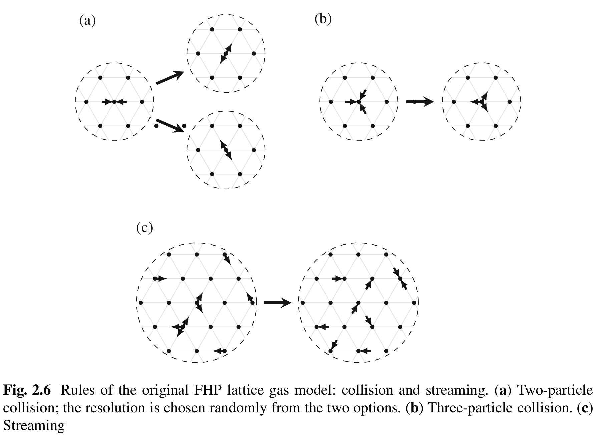

# Numerical Methods
## Finite Difference Method
The finite Difference Method (FDM) takes a set of equations and replaces the derivatives with finite difference approximations. The central difference scheme is more accurate than the forward or backward difference. However, in the advection term $\partial (\rho_\alpha u_\beta)/\partial x_\beta$, information comes only from the direction opposite of the flow, i.e., *upstream or upwind*. Since the central difference looks at both the upstream and downstream, it is possible to improve it by using an *upwind scheme*, where either a forward or backward scheme is used depending on the direction of fluid flow. **Checkerboard instability** arises in central difference scheme due to the first derivative being zero (the central difference scheme skips the value at the central node in its first derivative $\delta f(x) = f(x + h/2) - f (x - h/2)$). This zero gradient in the first derivative makes a rapidly varying field as being uniform. A solution to checkerboard instability is to use a staggered grid. The Navier-Stokes equation is non-linear due to the advection term and is solved by iterative "guesses." 

*Advantages*: 
- FD is simple

*Disadvantages:*
- FD is not conservative, or quantities are not precisely conserved
- Subjected to false diffusivity. Numerical errors cause diffusion even in a pure advection scheme. 
- Issues with complex geometries which do not conform to the grid itself.

## Finite Volume Method
FVM does not divide the space into a regular grid but subdivides the simulated volume $V$ into many smaller volumes $v_i$ (which may have different sizes and shapes), allowing for a better representation of the shape. FVM is designed to solve conservation equations. Sources and sinks of a quantity within the volume are balanced by that quantity's flux across the volume's boundary. The concept of *divergence theorem* is central to FV. The integral over the volume is split into a sum of integrals over the finite volumes and their surface. FVM is second-order accurate using linear approximation on the surfaces and edges from all adjacent volumes. 

*Advantages*: 
- Conservative equations are satisfied
- Can model complex geometries

*Disadvantages:*
- Making approximation of complex grid is difficult
- Higher-order FV is not straightforward

## Finite Element Method
Partial Differential Equations (PDEs) are solved using the integral form - weak form, where the PDE is multiplied with a weight function $w(x)$ and integrated over the domain of interest. 

*Advantages*: 
- Can solve complex geometries with unstructured mesh and higher-order functions

*Disadvantages:*
- Does not satisfy conservation equations by default
- Checkerboard instability may occur

## Particle-Based Methods
Particle-based methods do not directly discretize the equations of fluid mechanics. Instead, these methods represent fluid using particles (which may represent an atom, a molecule, a collection of molecules, or a portion of macroscopic fluid).

### Molecular Dynamics
Molecular Dynamics (MD) solves the interaction between molecules using the intermolecular forces and tracks particles' position by calculating the acceleration as per Newton's law. However, this method is intractable to solve continuum-scale problems; even a single gram of water has $10^22$ molecules.

### Lattice Gas Models
Fictitious particles exist on a grid, where they stream forwards and collide in a manner that respects the conservation of mass and momentum. Each node has a finite set of neighbors, and each particle has only a finite set of possible velocities $e_i$ that would bring a particle to a neighboring node in a single time step. Only up to one particle of a certain velocity can be present in a node at any time. Whether or not a particle of velocity $e_i$ exists at a lattice node at location $x$ at time $t$ is expressed by occupation number $n_i(x, t)$, where index $i$ refers to velocity $e_i$. The occupation number is a boolean variable that relates to macroscopic observables: mass density and momentum:

$$\rho(x, t) = \frac{m}{v_0}\sum_i n_i(x, t) \quad \rho u(x, t) = \frac{m}{v_0}\sum_i c_i n_i(x, t)$$

$m$ mass of a particle and $v_0$ is the volume covered by the node. 

The time evolution of lattice gas is determined by two rules: *collision* and *streaming*. *Collision* is where particles that met in a node may be redistributed in a way that conserves the mass and momentum in the node. 

$$n_i^*(x, t) = n_i(x, t) + \Omega_i (x, t)$$

$n_i^*$ is post collision occumputation number and $\Omega_i \in \{-1, 0, 1\}$ is the collision operator that may redistribute particles in a node based on all occupation numbers $\{n_i\}$ in that node. Collision must conserve mass $(\sum_i \Omega_i(x, t) = 0)$ and momentum $(\sum_i c_i\Omega_i(x, t) = 0)$

*Streaming*: after collisions, particles move from their current nodes to a neighboring node in their direction of velocity. The particle velocities $e_i$ are such that particles move exactly from one node to another within a time step. For a triangular grid, six velocities of magnitude $|c_i| = \Delta x / \Delta t$ exists, where $\Delta x$ is the distance between the nodes and $\Delta t$ is the time step. 

$$n_i(x, c_i \Delta t) = n_i^*(x, t)$$

Combining both streaming and collision:

$$n_i(x, c_i \Delta t, t + \Delta t) =n_i(x, t) + \Omega_i (x, t)$$

*Advantages*:
- Collision operator is boolean, so the collisions are perfect and not prone to floating-point errors
- Massively parallelizable.

*Disadvantages*:
- Computationally expensive. 3D gas with 24 velocities has $2^24 = 1.68E7$ possible states in each node. 
- Problems with isotropy can only disappear at low Mach numbers (quasi-incompressible flows).
- Cannot reach high Reynolds number
- Staticial noise can form even in gas at an equilibrium state.

### Lattice Boltzmann Method (LBM)
LBM tracks the distribution of particles instead of concrete particles. It is based on the Boltzmann equation. The standard LBM is second-order accurate for weakly compressible Navier-Stokes equation. Weakly compressible refers to errors occurring when the Mach number approaches one. Conventional CFD, the advection term $u \cdot \nabla u$ is nonlinear. In LBM, "* nonlinearity is local, and non-locality is linear*." Interactions between nodes are entirely linear, while the method's nonlinearity enters in the local collision process within each node.
