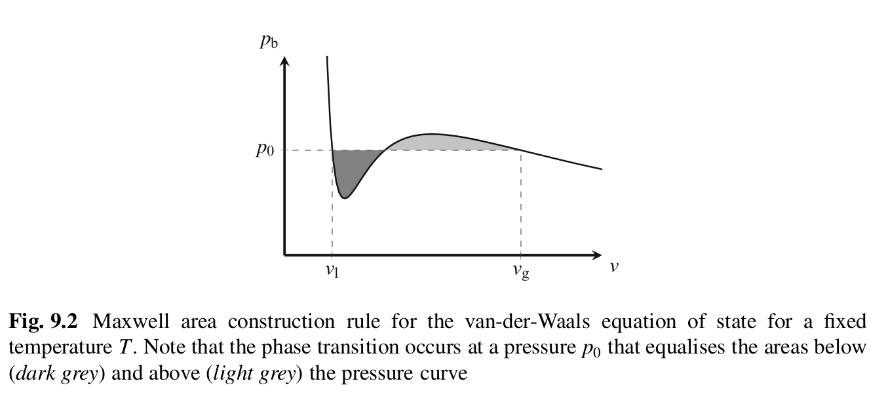

In single-component multiphase flows, the liquid and gas phases of the same substances are in coexistence. Gas can condense to form more liquid, and liquid can evaporate. In multicomponent flow, the substances do not interconvert. Instead, they diffuse between these components. 

Gas and liquid phases are uniquely characterized by density $\rho_g$ and $\rho_l$. An order parameter:

$$\phi = \frac{\rho^{(1)} - \rho^{(2)}}{\rho^{(1)}+ \rho^{(2)}}$$

$\phi = +1$ denotes bulk phase 1 and $\phi = -1$ denotes bulk phase 2. Multicomponent flows can be miscible (water and gas) or immiscible (water and oil). 

The coexistance of phases / components constrain the Equation of State (EoS), which describes the relation between pressure $p$, molar volume $v (\rho \propto 1/v)$, order parameter $\phi$ for a given temperature $T$. The EoS $p = p_b(\rho, \phi, T, \dots)$ uniquely defines the bulk (region away from any interface) thermodynamic state of the multiphase and multicomponent system.

_van der Waals_ EOS for a liquid-vapor system describes that the pressure-molar volume curve has a minimum and maximum. Any EoS with this properly allows for coexisting bulk fluids. The thermodynamic state between these two extrema is unstable. If the system is prepared at any of these intermediary states, it will spontaneously phase separate into liquid and gas domains. For a given pressure $p_0$, the molar volume of liquid and gas phases are $v_l$ and $v_g$.

There is a range of pressures for which two distinct molar volumes $v$ can be adopted for the same bulk pressure value $p_b$. Maxwell area construction rule postulates that for a given temperature $T$, the liquid-gas coexistence happens at pressure $p_0$ such that both shaded areas in the pressure - molar volume curves are identical.

$$\int_{v_g}^{v_l} (p_0 -p_b(v^\prime, T)) dv = 0, \qquad p_b = p_b(v_g, T) = p_b(v_l, T)$$

Maxwell area construction states at coexistence the Gibbs Free Energy $G$ of liquid and gas phases must be equal:

$$G_{l/g} = F_{l/g} + p_0 v_{l/g}$$

$F$ is the Helmholtz free energy.

In LB, we use density instead of molar volume. 

$$\int_{\rho_g}^{\rho_l} (p_0 - p_b(\rho^\prime, T)) \frac{d\rho^\prime}{\rho^{\prime 2}} = 0$$

Any model that satisfies the above equation is thermodynamically consistent.