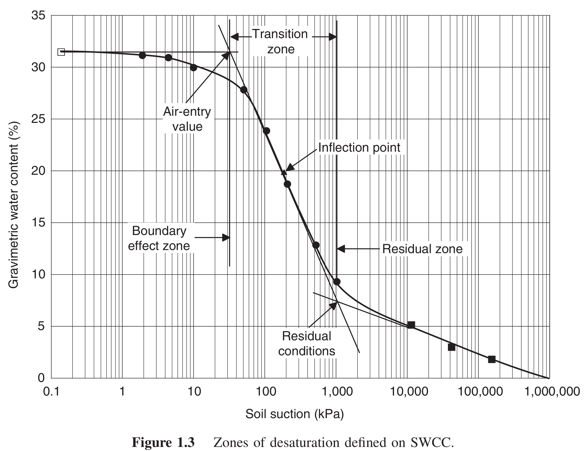

# Introduction
An unsaturated soil has more than two phases: water and air. The pore-water pressure is negative relative to the pore-air pressure. The air-water interface (contractile skin) plays an important role in the behavior of unsaturated soil. Unsaturated soil zone usually refers to the transition region between the water in the atmosphere and the groundwater (positive pore water pressure zone). The pore water pressures in the unsaturated zone can range from zero to 1 GPa (Croney 1958). Based on the degree of saturation, the soil can be categorized to be in different states. 

| Degree of Saturation (Sr) | Properties |
|---------------------------|------------|
| ~ 100 % | Saturated |
| 90 - 100 % | Boundary effects / capillary zone |
| 15 - 90 | Two phase / Transition zone |
| < 15 % | Dry / residual zone |

Briggs (1897): Water in soil was classified on the basis of the mechanism by which the water was held in pores:
- *Hygroscopic water* was assumed to be held on soil particles by attractive forces.
- *Capillary water* was assumed to be held by surface tension forces
- *Gravitational water* was assumed to be water that could freely drain from the soil because the soil particles did not hold it. 

